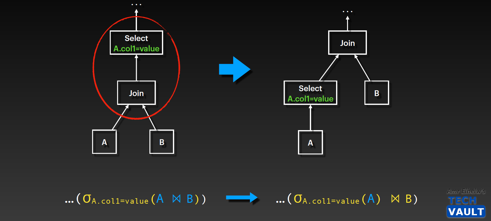
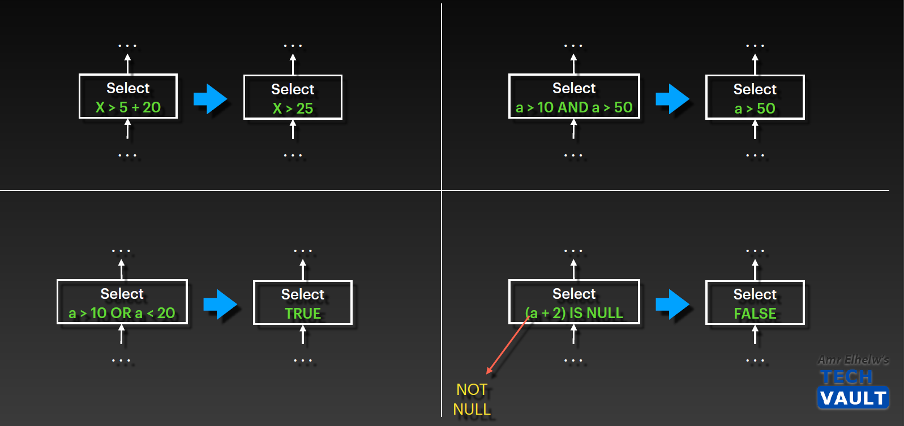
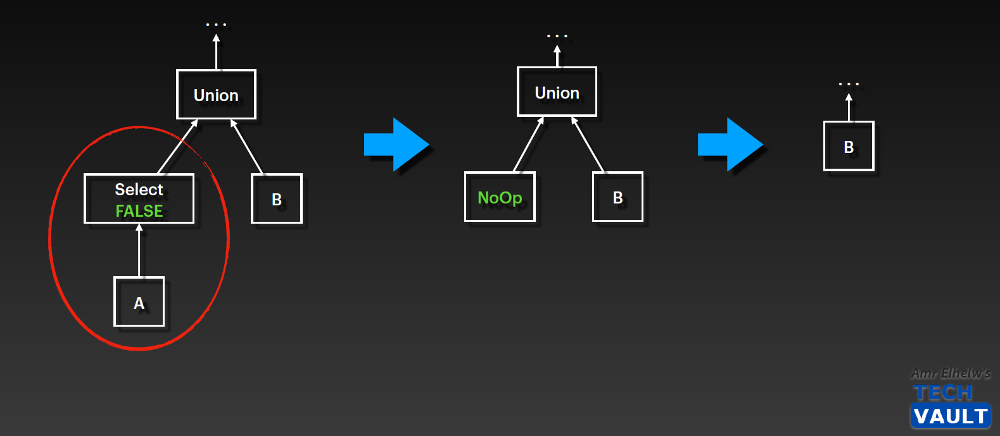
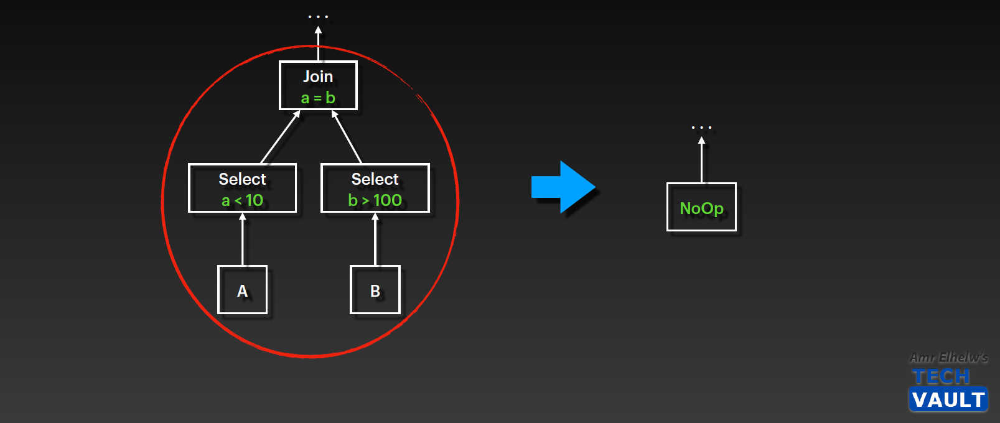

# SQL Optimizer

## **Logical Nodes vs Physical Nodes**

### Logical Nodes

- An abstract operation - cannot be executed
- Corresponds to relational algebra
- E.g.: Join, Scan, Aggregation, etc.

### Physical Nodes

- An concrete algorithm/implementation
- Can be executed, has a cost function
- E.g.: NL Join, Hash Join, Full scan, Index Scan, Sort- and Hash-based Aggregation, etc.

---

## **1. Role-Based Optimization**

- Known as elimination process as it eliminate query based on some rules regardless it cost

- it uses More relational algebra transformation rules.

### Filter push-down

### Expression Simplification

### Empty Subtree Elimination

---

## **2. Cost-Based Optimization**

- Join Order
- Access Path Selection (Full scan, index scan, etc.)
- Join algorithms (NL, Hash, Merge…)
- Aggregation algorithms
- Sorting algorithms
- Etc.

### Transformations

