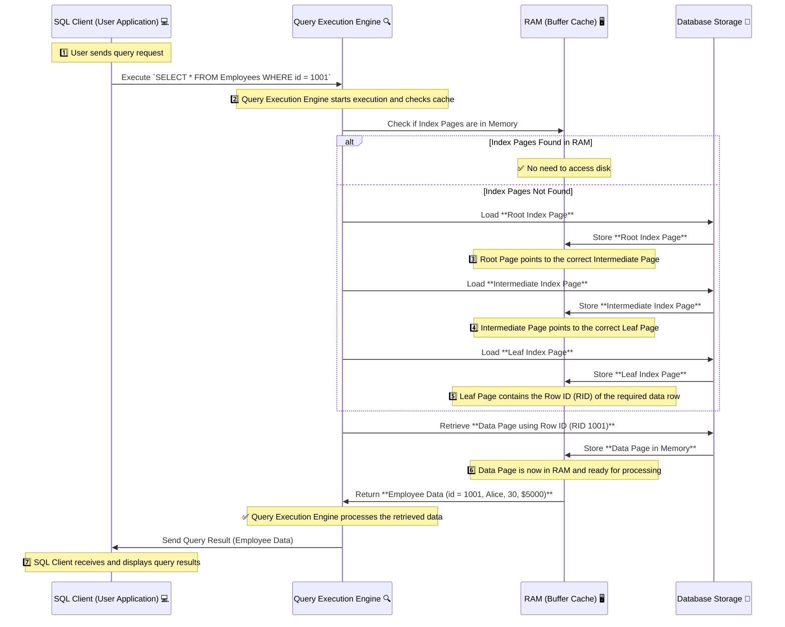
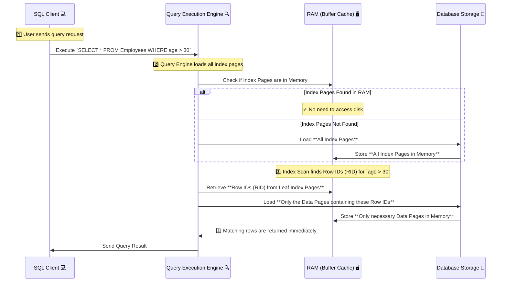
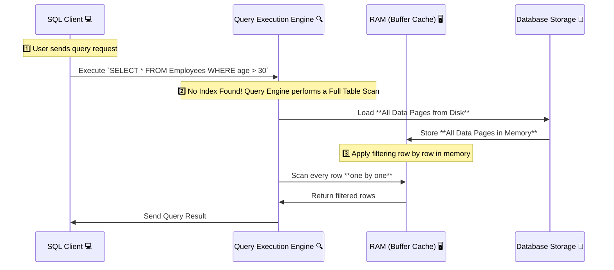

# 🔎 **Index Seek vs. Index Scan vs. Table Scan**

Indexes help databases **retrieve data efficiently**, but how they are used—via **Index Seek, Index Scan, or Table Scan**—greatly impacts **query performance**.

**✅ Index Seek:**

✔ **Uses B-Tree traversal** to quickly find **only necessary data pages**.  
✔ **Highly efficient for selective queries**.

**⚠️ Index Scan:**

✔ **Reads all index entries sequentially**, then retrieves **all matching data pages**.  
✔ **Better than Table Scan but still slower than Index Seek**.

**❌ Table Scan:**

✔ **Reads every row in the table** without using an index.  
✔ **Slowest option, causing high disk I/O and memory usage**.

> Table scan means iterate over all table rows.
> Index scan means iterate over all index items, when item index meets search condition, table row is retrived through index.
> Usually index scan is less expensive than a table scan because index is more flat than a table.

---

## **📌 How Indexes Store Data (B-Tree Structure)**

Indexes are **stored in structured pages** using a **B-Tree (Balanced Tree) structure**, with three levels:

| **Page Type**          | **Function**                                                      |
| ---------------------- | ----------------------------------------------------------------- |
| **Root Page**          | Entry point for searches, stores pointers to intermediate pages.  |
| **Intermediate Pages** | Store **pointers to leaf pages** for faster lookups.              |
| **Leaf Pages**         | Contain **Row IDs (RID)** or **actual data (Clustered Indexes).** |

✅ **Index pages are separate from data pages**, allowing faster lookups.

---

## **📌 What is Index Seek?**

✔ **Index Seek is a targeted search** that **navigates the B-Tree structure**, finds **only relevant rows**, and retrieves **only required data pages**.

### **Lifecycle of an Index Seek**

**1️⃣ Root Index Page is loaded into memory.**  
**2️⃣ B-Tree Traversal is performed to find the Leaf Page.**  
**3️⃣ Leaf Page contains the Row ID (RID).**  
**4️⃣ Only the necessary data page is fetched using the RID.**  
**5️⃣ Matching rows are returned.**

🔹 **Index Seek is optimal for queries retrieving a small number of rows.**

---

### **Example: How Index Seek Works**

✔ **Scenario: Searching for `id = 1001` in an Index**

```sql
SELECT * FROM Employees WHERE id = 1001;
```

| **Index Level**                 | **Page Content**                                             |
| ------------------------------- | ------------------------------------------------------------ |
| **Root Page**                   | Pointers to **Intermediate Pages**                           |
| **Intermediate Page 1**         | Pointers to **Leaf Pages (id: 1 - 1000, 1001 - 2000, etc.)** |
| **Leaf Page (id: 1001 - 2000)** | **Row ID (1001) → Page 50**                                  |
| **Data Page 50**                | Full record: **(1001, Alice, 30, \$5000)**                   |

---

### **Index Seek Execution Process**



✔ **Only the necessary index and data pages are accessed.**  
✔ **Efficient B-Tree search avoids reading unnecessary pages.**

---

## **📌 What is Index Scan?**

❌ **Index Scan reads all index pages sequentially, loads all matching data pages into memory, and then returns the result.**

### **Lifecycle of an Index Scan**

**1️⃣ All index pages are read sequentially** to find **Row IDs (RID)** that match the query condition.  
**2️⃣ Only the necessary data pages containing those Row IDs are loaded into memory.**  
**3️⃣ Matching rows are immediately returned to the query engine.**

🔹 **Unlike a Table Scan, an Index Scan does not read all data pages—it first finds Row IDs in the index before accessing data pages.**

---

### **Example: How Index Scan Works**

✔ **Scenario: Searching for `age > 30`**

```sql
SELECT * FROM Employees WHERE age > 30;
```

| **Index Level** | **Page Content**                            |
| --------------- | ------------------------------------------- |
| **Root Page**   | Pointers to all rows.                       |
| **Leaf Pages**  | Contains **all employee records**.          |
| **Data Pages**  | All pages loaded into RAM before filtering. |

---

### **Index Scan Execution Process**



✔ **Index Scan loads only the required data pages, unlike Table Scan.**

---

## **📌 What is Table Scan?**

❌ **Table Scan reads every row in the table because no index is used.**

### **Lifecycle of a Table Scan**

**1️⃣ All data pages for the table are read into memory.**  
**2️⃣ Filtering is applied row by row in memory.**  
**3️⃣ Matching rows are returned.**

🔹 **Table Scan is the slowest method and should be avoided.**

---

### **Table Scan Execution Process**



## **🚀 Performance Comparison: Index Seek vs. Index Scan vs. Table Scan**

| **Feature**      | **Index Seek ✅**               | **Index Scan ⚠️**                        | **Table Scan ❌**                |
| ---------------- | ------------------------------- | ---------------------------------------- | -------------------------------- |
| **Data Access**  | **B-Tree Traversal**            | **Reads all index rows**                 | **Reads all table rows**         |
| **Performance**  | ✅ **Fastest (Selective Read)** | ⚠️ **Moderate (Index Read + Data Read)** | ❌ **Slowest (Full Table Read)** |
| **I/O Overhead** | ✅ **Low**                      | ⚠️ **Medium**                            | ❌ **High**                      |
| **CPU Cost**     | ✅ **Low**                      | ⚠️ **Moderate**                          | ❌ **Very High**                 |
