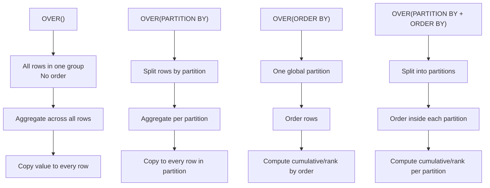

# 🪟 Behaviors of Window Functions in SQL Server

The behavior of a window function depends on **what you put inside `OVER()`**.
There are **four main cases**:

1. `OVER()` (empty)
2. `OVER(PARTITION BY …)`
3. `OVER(ORDER BY …)`
4. `OVER(PARTITION BY … ORDER BY …)`

---

## 1️⃣ Case A: `OVER()` (Empty)

👉 Meaning: **No partition, no order**.

- All rows are considered as **one global group**.
- Aggregates = single global value, copied to every row.
- Ranking functions ❌ not allowed (they need `ORDER BY`).

### Example

```sql
SELECT
    Name,
    Salary,
    SUM(Salary) OVER () AS TotalSalary,
    AVG(Salary) OVER () AS AvgSalary
FROM Employees;
```

**Input:**

| Name  | Salary |
| ----- | ------ |
| Alice | 6000   |
| Bob   | 5000   |
| Carol | 4000   |

**Output:**

| Name  | Salary | TotalSalary | AvgSalary |
| ----- | ------ | ----------- | --------- |
| Alice | 6000   | 15000       | 5000      |
| Bob   | 5000   | 15000       | 5000      |
| Carol | 4000   | 15000       | 5000      |

---

## 2️⃣ Case B: `OVER(PARTITION BY …)`

👉 Meaning: **Distributed snapshot per group**.

- Rows are split into partitions (like GROUP BY).
- Aggregate is computed **per partition**, then copied to every row.
- Order is not considered.

### Example

```sql
SELECT
    Name,
    Dept,
    Salary,
    AVG(Salary) OVER (PARTITION BY Dept) AS DeptAvg
FROM Employees;
```

**Input:**

| Name  | Dept | Salary |
| ----- | ---- | ------ |
| Alice | IT   | 6000   |
| Bob   | IT   | 5000   |
| Carol | HR   | 4000   |
| Dave  | HR   | 4500   |

**Partitions:**

- IT → {Alice, Bob} → Avg = 5500
- HR → {Carol, Dave} → Avg = 4250

**Output:**

| Name  | Dept | Salary | DeptAvg |
| ----- | ---- | ------ | ------- |
| Alice | IT   | 6000   | 5500    |
| Bob   | IT   | 5000   | 5500    |
| Carol | HR   | 4000   | 4250    |
| Dave  | HR   | 4500   | 4250    |

---

## 3️⃣ Case C: `OVER(ORDER BY …)`

👉 Meaning: **Running/cumulative behavior across the whole dataset**.

- No partitions → one big group.
- Order defines sequence.
- Aggregates = cumulative values up to current row.
- Ranking functions = assign position numbers.

### Example (running total)

```sql
SELECT
    Name,
    Salary,
    SUM(Salary) OVER (ORDER BY Salary) AS RunningTotal
FROM Employees;
```

**Input (ordered by Salary):**

| Name  | Salary |
| ----- | ------ |
| Carol | 4000   |
| Bob   | 5000   |
| Alice | 6000   |

**Step by Step:**

- Carol (4000) → 4000
- Bob (5000) → 4000 + 5000 = 9000
- Alice (6000) → 4000 + 5000 + 6000 = 15000

**Output:**

| Name  | Salary | RunningTotal |
| ----- | ------ | ------------ |
| Carol | 4000   | 4000         |
| Bob   | 5000   | 9000         |
| Alice | 6000   | 15000        |

---

## 4️⃣ Case D: `OVER(PARTITION BY … ORDER BY …)`

👉 Meaning: **Running behavior inside partitions**.

- First split rows into partitions.
- Then apply order within each partition.
- Aggregates = cumulative per partition.
- Ranking functions = row positions per partition.

### Example (running total per dept)

```sql
SELECT
    Dept,
    Name,
    Salary,
    SUM(Salary) OVER (PARTITION BY Dept ORDER BY Salary) AS RunningDeptTotal
FROM Employees;
```

**Input:**

| Name  | Dept | Salary |
| ----- | ---- | ------ |
| Alice | IT   | 6000   |
| Bob   | IT   | 5000   |
| Eve   | IT   | 7000   |
| Carol | HR   | 4000   |
| Dave  | HR   | 4500   |

**Partition IT (ordered by Salary):**

- Bob (5000) → 5000
- Alice (6000) → 5000 + 6000 = 11000
- Eve (7000) → 18000

**Partition HR (ordered by Salary):**

- Carol (4000) → 4000
- Dave (4500) → 8500

**Output:**

| Dept | Name  | Salary | RunningDeptTotal |
| ---- | ----- | ------ | ---------------- |
| IT   | Bob   | 5000   | 5000             |
| IT   | Alice | 6000   | 11000            |
| IT   | Eve   | 7000   | 18000            |
| HR   | Carol | 4000   | 4000             |
| HR   | Dave  | 4500   | 8500             |

---

## 🖼️ Diagram: How SQL Server Sees It

<div align="center">



</div>

---

## 🎯 Summary Table

| Case | Syntax                            | Behavior                               |
| ---- | --------------------------------- | -------------------------------------- |
| A    | `OVER()`                          | Distributed snapshot over entire table |
| B    | `OVER(PARTITION BY …)`            | Distributed snapshot per partition     |
| C    | `OVER(ORDER BY …)`                | Running/cumulative across all rows     |
| D    | `OVER(PARTITION BY … ORDER BY …)` | Running/cumulative per partition       |
