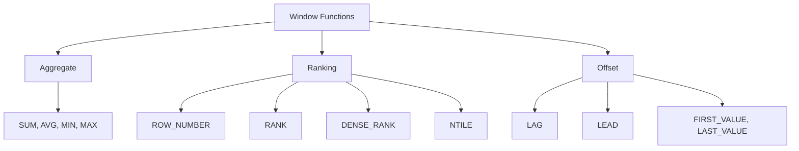

# 🪟 Categories of Window Functions

## 1️⃣ Aggregate Window Functions

_(`SUM`, `AVG`, `MIN`, `MAX`, `COUNT` …)_

👉 These are **normal aggregate functions**, but instead of collapsing rows with `GROUP BY`, they preserve every row and show the result as an extra column.

### Example A: Department Average Salary

```sql
SELECT
    Name,
    Dept,
    Salary,
    AVG(Salary) OVER (PARTITION BY Dept) AS DeptAvg
FROM Employees;
```

**Input:**

| Name  | Dept | Salary |
| ----- | ---- | ------ |
| Alice | IT   | 6000   |
| Bob   | IT   | 5000   |
| Eve   | IT   | 7000   |
| Carol | HR   | 4000   |
| Dave  | HR   | 4500   |

**Output:**

| Name  | Dept | Salary | DeptAvg |
| ----- | ---- | ------ | ------- |
| Alice | IT   | 6000   | 6000    |
| Bob   | IT   | 5000   | 6000    |
| Eve   | IT   | 7000   | 6000    |
| Carol | HR   | 4000   | 4250    |
| Dave  | HR   | 4500   | 4250    |

---

### Example B: Running Total (no GROUP BY)

```sql
SELECT
    Name,
    Salary,
    SUM(Salary) OVER (ORDER BY Salary) AS RunningTotal
FROM Employees;
```

**Output:**

| Name  | Salary | RunningTotal |
| ----- | ------ | ------------ |
| Carol | 4000   | 4000         |
| Bob   | 5000   | 9000         |
| Alice | 6000   | 15000        |
| Eve   | 7000   | 22000        |

✅ Notice: `GROUP BY` would collapse, but here we still have every row.

---

## 2️⃣ Ranking Window Functions

_(`ROW_NUMBER`, `RANK`, `DENSE_RANK`, `NTILE`)_

👉 These assign **positions** to rows based on an `ORDER BY`, optionally reset by `PARTITION BY`.

---

### Example A: `ROW_NUMBER()`

- Assigns a unique number per row.
- No ties, always sequential (1,2,3…).

```sql
SELECT
    Name,
    Dept,
    Salary,
    ROW_NUMBER() OVER (PARTITION BY Dept ORDER BY Salary DESC) AS RowNum
FROM Employees;
```

**Output:**

| Name  | Dept | Salary | RowNum |
| ----- | ---- | ------ | ------ |
| Eve   | IT   | 7000   | 1      |
| Alice | IT   | 6000   | 2      |
| Bob   | IT   | 5000   | 3      |
| Dave  | HR   | 4500   | 1      |
| Carol | HR   | 4000   | 2      |

---

### Example B: `RANK()` vs `DENSE_RANK()`

- Both assign ranks based on ordering.
- Difference: how they treat **ties**.

```sql
SELECT
    Name,
    Dept,
    Salary,
    RANK() OVER (PARTITION BY Dept ORDER BY Salary DESC) AS RankSalary,
    DENSE_RANK() OVER (PARTITION BY Dept ORDER BY Salary DESC) AS DenseRankSalary
FROM Employees;
```

If IT salaries were: {7000, 6000, 6000, 5000}

| Name  | Salary | RANK | DENSE_RANK |
| ----- | ------ | ---- | ---------- |
| Eve   | 7000   | 1    | 1          |
| Alice | 6000   | 2    | 2          |
| Bob   | 6000   | 2    | 2          |
| Dan   | 5000   | 4    | 3          |

✅ `RANK()` leaves a gap after ties (2,2,4).
✅ `DENSE_RANK()` keeps it dense (2,2,3).

---

### Example C: `NTILE(n)`

- Splits rows into **n buckets**.
- Useful for quartiles, deciles, etc.

```sql
SELECT
    Name,
    Salary,
    NTILE(4) OVER (ORDER BY Salary DESC) AS Quartile
FROM Employees;
```

**Output:**

| Name  | Salary | Quartile |
| ----- | ------ | -------- |
| Eve   | 7000   | 1        |
| Alice | 6000   | 1        |
| Bob   | 5000   | 2        |
| Dave  | 4500   | 3        |
| Carol | 4000   | 4        |

---

## 3️⃣ Offset Functions

_(`LAG`, `LEAD`, `FIRST_VALUE`, `LAST_VALUE`)_

👉 These **peek at other rows** relative to the current row.
Super useful for **comparisons** (e.g., current vs previous month).

---

### Example A: `LAG()` (look backwards)

```sql
SELECT
    EmpID,
    HireDate,
    Salary,
    LAG(Salary, 1) OVER (ORDER BY HireDate) AS PrevSalary
FROM Employees;
```

**Output:**

| EmpID | HireDate   | Salary | PrevSalary |
| ----- | ---------- | ------ | ---------- |
| 1     | 2020-01-01 | 4000   | NULL       |
| 2     | 2020-03-01 | 4500   | 4000       |
| 3     | 2020-04-01 | 5000   | 4500       |

---

### Example B: `LEAD()` (look forwards)

```sql
SELECT
    EmpID,
    HireDate,
    Salary,
    LEAD(Salary, 1) OVER (ORDER BY HireDate) AS NextSalary
FROM Employees;
```

**Output:**

| EmpID | HireDate   | Salary | NextSalary |
| ----- | ---------- | ------ | ---------- |
| 1     | 2020-01-01 | 4000   | 4500       |
| 2     | 2020-03-01 | 4500   | 5000       |
| 3     | 2020-04-01 | 5000   | NULL       |

---

### Example C: Comparing Current vs Previous

```sql
SELECT
    EmpID,
    Salary,
    Salary - LAG(Salary,1) OVER (ORDER BY HireDate) AS SalaryDiff
FROM Employees;
```

**Output:**

| EmpID | Salary | SalaryDiff |
| ----- | ------ | ---------- |
| 1     | 4000   | NULL       |
| 2     | 4500   | 500        |
| 3     | 5000   | 500        |

✅ `LAG/LEAD` = no joins needed to compare rows.

---

## 🖼️ Diagram: Categories of Window Functions

<div align="center">



</div>

---

## 🎯 Key Takeaways

- **Aggregate functions** → snapshots (per group or running totals).
- **Ranking functions** → assign positions within partitions.
- **Offset functions** → allow row-to-row comparisons without self-joins.
- All use the same `OVER()` syntax, just different **families of functions**.
