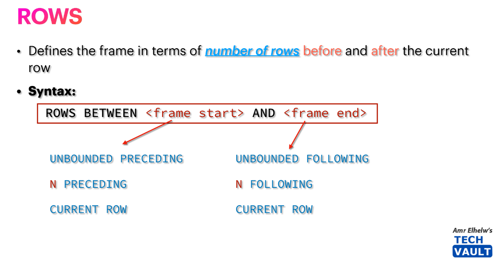
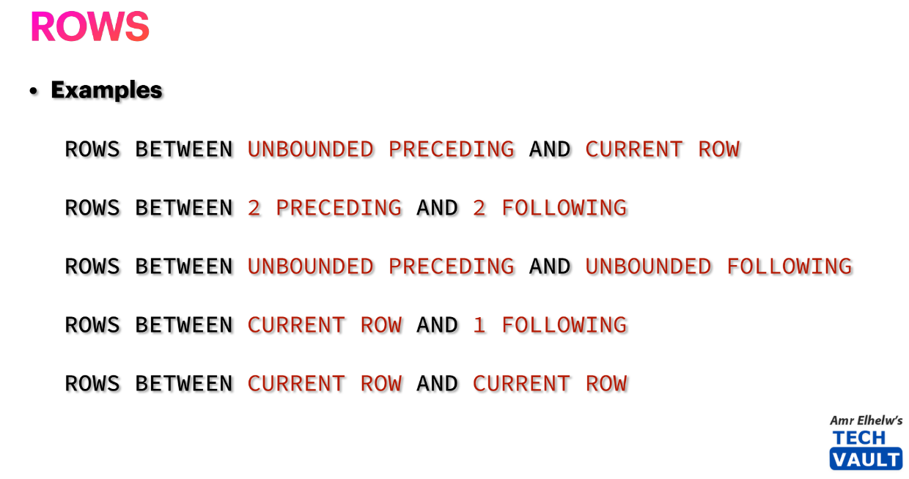
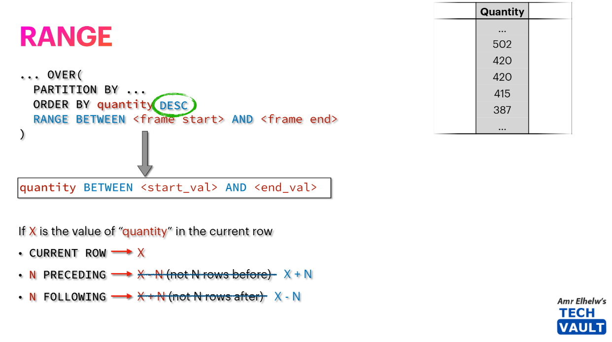
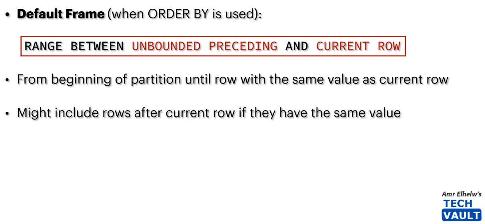

# 🪟 **Window Function Framing**

## 🔙 **First, What is a Window Function?**

- A **window function** looks at a **set of rows (a window)** relative to the current row.
- For each row → it calculates something (sum, average, rank, lag, etc.) based on that window.

The **`OVER()` clause** defines that window.

---

## 🤔 **What Defines a Window?**

A window is built from **3 layers**:

1. **PARTITION BY** → _which group of rows?_
   (like `GROUP BY`, but without collapsing rows)

2. **ORDER BY** → _in what sequence inside that group?_

3. **FRAME** → _which subset of those ordered rows should each row look at?_

---

## 💭 **Why Do We Need Frames?**

- Without frames: you only get running totals or whole-partition results.
- With frames: you can zoom in → _“just the last 3 rows”_ or _“from start to here”_.

➡️ Frames give **fine-grained control** over “which rows each calculation sees.”

---

## 🎭 **Types of Frames**

There are **3 important concepts** in framing:

### 1️⃣ **Row-based frames**

- Defined by **physical rows** relative to the current one.
- Example:

  ```sql
  ROWS BETWEEN 1 PRECEDING AND CURRENT ROW
  ```

  → current row + 1 before it.

---

<div align="center">
  
</div>

<div align="center">
  
</div>

---

### 2️⃣ **Range-based frames**

- Defined by **values** in the `ORDER BY` column.
- Example:

  ```sql
  RANGE BETWEEN 100 PRECEDING AND CURRENT ROW
  ```

  → includes all rows whose value is within `100` of the current row’s value.

---

<div align="center">
  
</div>

<div align="center">
  
</div>

---

### 📌 **Defaults**

- If you say just:

  ```sql
  SUM(Salary) OVER (ORDER BY HireDate)
  ```

  SQL Server _assumes_:

  ```sql
  ROWS BETWEEN UNBOUNDED PRECEDING AND CURRENT ROW
  ```

  ➡️ i.e., **running total**.

---

<div align="center">
  
</div>

---

## 🏛️ **Frame Options**

Here are the building blocks:

- **UNBOUNDED PRECEDING**
  - ROW → “from the first row of the partition.”
  - RANGE → “from the very first row of the partition.”
- **CURRENT ROW**
  - “just this row.”
- **N PRECEDING**
  - “N rows before.”
- **N FOLLOWING**
  - “N rows after.”
- **UNBOUNDED FOLLOWING**
  - ROWS → “to the last row of the partition.”
  - RANGE → “to the very last row of the partition.”

---

## ✍🏻 **Examples**

Suppose we have salaries ordered by hire date:

| Row | Salary |
| --- | ------ |
| 1   | 4000   |
| 2   | 4500   |
| 3   | 5000   |
| 4   | 6000   |

---

### Example 1: Running Total (default)

```sql
SUM(Salary) OVER (ORDER BY HireDate)
```

Frame = `UNBOUNDED PRECEDING → CURRENT ROW`

| Row | Frame Rows            | SUM   |
| --- | --------------------- | ----- |
| 1   | {4000}                | 4000  |
| 2   | {4000,4500}           | 8500  |
| 3   | {4000,4500,5000}      | 13500 |
| 4   | {4000,4500,5000,6000} | 19500 |

---

### Example 2: Moving Window (last 2 rows)

```sql
SUM(Salary) OVER (
  ORDER BY HireDate
  ROWS BETWEEN 1 PRECEDING AND CURRENT ROW
)
```

| Row | Frame Rows  | SUM   |
| --- | ----------- | ----- |
| 1   | {4000}      | 4000  |
| 2   | {4000,4500} | 8500  |
| 3   | {4500,5000} | 9500  |
| 4   | {5000,6000} | 11000 |

---

### Example 3: Centered Window

```sql
AVG(Salary) OVER (
  ORDER BY HireDate
  ROWS BETWEEN 1 PRECEDING AND 1 FOLLOWING
)
```

| Row | Frame Rows       | AVG  |
| --- | ---------------- | ---- |
| 1   | {4000,4500}      | 4250 |
| 2   | {4000,4500,5000} | 4500 |
| 3   | {4500,5000,6000} | 5167 |
| 4   | {5000,6000}      | 5500 |

---

### Example 4: Whole Partition

```sql
SUM(Salary) OVER (
  ORDER BY HireDate
  ROWS BETWEEN UNBOUNDED PRECEDING AND UNBOUNDED FOLLOWING
)
```

| Row | Frame Rows            | SUM   |
| --- | --------------------- | ----- |
| 1   | {4000,4500,5000,6000} | 19500 |
| 2   | {4000,4500,5000,6000} | 19500 |
| 3   | {4000,4500,5000,6000} | 19500 |
| 4   | {4000,4500,5000,6000} | 19500 |

---

## 🎯 Big Takeaways

1. **Partition** = who’s in the group.
2. **Order** = how they’re lined up.
3. **Frame** = which slice of that lineup is visible to each row.

- Default = _running frame_ (start → current row).
- Frames let you do **running totals, moving averages, rolling sums, centered windows, full totals**, etc.
