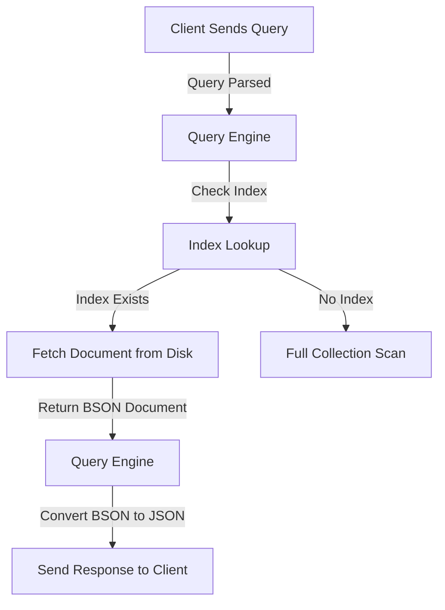
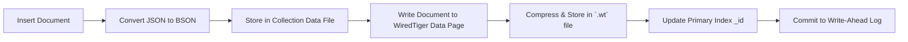
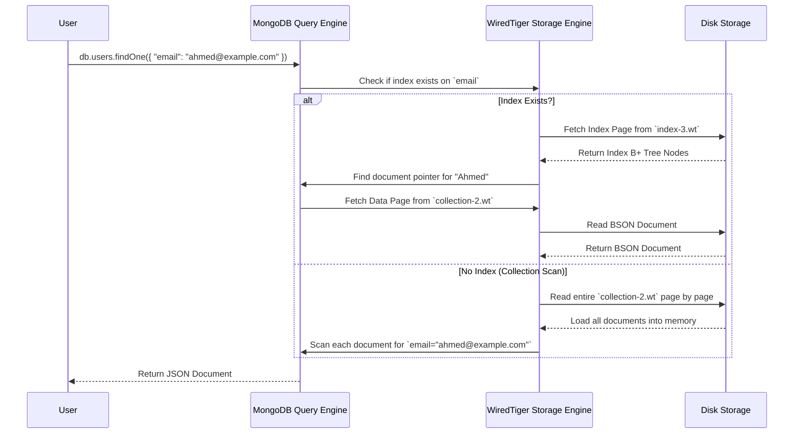

# 🏗️ **1️⃣ MongoDB Components Overview – The Building Blocks**

MongoDB is a **document-based NoSQL database** that stores data in **JSON-like BSON format**. Unlike SQL databases that rely on **tables, rows, and columns**, MongoDB structures data in **collections** containing **schema-less documents**.

## **🔷 Key Components of MongoDB**

| **Component**         | **Description**                                                   |
| --------------------- | ----------------------------------------------------------------- |
| **Database** 🗄️       | A container holding multiple collections.                         |
| **Collection** 📂     | A group of documents (similar to a SQL table).                    |
| **Document** 📜       | A single record in MongoDB (stored as BSON).                      |
| **Index** 🔍          | A B+ Tree structure that speeds up lookups.                       |
| **Storage Engine** ⚙️ | The system that manages data storage on disk.                     |
| **Query Engine** 🔄   | Parses, optimizes, and executes queries.                          |
| **Replication** 🌍    | Keeps copies of data across multiple servers for fault tolerance. |
| **Sharding** 📡       | Distributes large datasets across multiple nodes.                 |

> 💡 **MongoDB stores everything in BSON (Binary JSON), which is faster and more efficient than raw JSON.**

---

## 🛠️ **How MongoDB Works Internally (Flowchart)**

<div style="display: flex; justify-content: center; align-items: center;">



</div>

> 💡 **MongoDB first checks indexes** before scanning the entire collection to improve performance.

---

## **🛠️ 2️⃣ How Documents & Collections Work in MongoDB**

MongoDB is **document-based**, meaning it doesn’t have **fixed schemas** like SQL databases.

### **📂 How Data is Stored in Documents & Collections**

#### **📌 SQL vs. MongoDB (Structure Comparison)**

| **SQL** | **MongoDB**                     |
| ------- | ------------------------------- |
| Tables  | Collections                     |
| Rows    | Documents                       |
| Columns | Fields                          |
| Joins   | Embedded Documents / References |

✅ **Documents in a collection can have different fields.**  
✅ **No strict schema is required, allowing flexible data models.**

#### **📜 Example: SQL Table vs. MongoDB Document**

📌 **SQL Table (Users Table)**

```sql
CREATE TABLE users (
  id SERIAL PRIMARY KEY,
  name VARCHAR(255),
  age INT,
  email VARCHAR(255)
);
```

📌 **MongoDB Equivalent (Users Collection)**

```json
{
  "_id": ObjectId("65a1b2c3d4e5f6g7h8i9j0"),
  "name": "Ahmed",
  "age": 27,
  "email": "ahmed@example.com"
}
```

🚀 **MongoDB allows storing arrays & nested objects within a document.**

---

### 🔍 **How MongoDB Stores Documents on Disk (Flowchart)**



📌 **MongoDB uses BSON for efficient storage and compression.**

---

## **🔍 3️⃣ How Indexing Works in MongoDB (Primary & Secondary Indexes)**

Indexes speed up **read operations** by creating a **B+ Tree structure** that maps field values to document locations.

### **📌 Primary vs. Secondary Indexes**

| **Index Type**           | **Description**                                        |
| ------------------------ | ------------------------------------------------------ |
| **Primary Index (\_id)** | Automatically created for every document.              |
| **Secondary Index**      | User-defined indexes on fields (e.g., `{ email: 1 }`). |

> ✔️ **Without an index, MongoDB does a full collection scan!**  
> ✔️ **With an index, MongoDB quickly finds the document using B+ Trees.**

---

### 🔍 **How MongoDB Uses Indexes for Queries (Sequence Diagram)**



> 💡 **Indexes allow MongoDB to locate documents efficiently instead of scanning everything.**

---

## **🔥 Next Topics:**

Now that we've covered **MongoDB Components, Documents, Collections, and Indexing**, we can move to **MongoDB Storage Engines & Query Execution Internals**.

🛠 **Next Topics:**  
✅ **MongoDB Storage Engines Evolution (MMAPv1 vs. WiredTiger)**  
✅ **How WiredTiger Works (Compression, Caching, Journaling, MVCC, etc.)**  
✅ **How Queries Are Executed (Query Planner, Execution Plan, Index Selection)**

💡 **Let me know if you want to continue! 🚀🔥**
