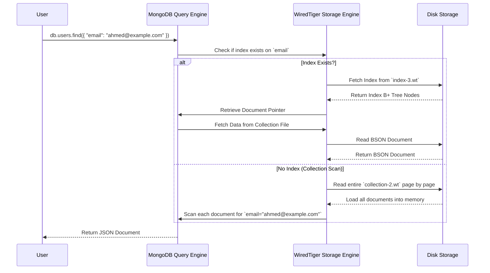

# **🔍 MongoDB Internals – Performance Tuning & Optimization 🚀**

MongoDB performance is highly dependent on **efficient indexing, query patterns, memory usage, and storage configurations**. Poorly designed queries or indexes can cause **slow response times, excessive disk I/O, and high memory consumption**.

---

## **🔍 1️⃣ How to Analyze MongoDB Query Performance**

MongoDB provides built-in tools to analyze query performance and detect bottlenecks.

### **💡 Key Tools for Query Performance Analysis**

| **Tool**         | **Purpose**                                                  |
| ---------------- | ------------------------------------------------------------ |
| **explain()**    | Shows the execution plan of a query.                         |
| **profiler**     | Captures slow queries automatically.                         |
| **\$indexStats** | Provides index usage statistics.                             |
| **\$collStats**  | Shows collection-level statistics (size, index usage, etc.). |

---

### **🔍 Using `explain()` to Analyze Queries**

💡 **`explain()` helps identify whether MongoDB is using an index efficiently or performing a full collection scan.**

#### **Example 1: A Query with Index Usage**

```json
db.users.find({ "email": "ahmed@example.com" }).explain("executionStats")
```

💡 **Expected Output (Index Scan Used)**

```json
{
  "executionStages": {
    "stage": "IXSCAN", // Index Scan (Good)
    "keysExamined": 1,
    "documentsExamined": 1,
    "executionTimeMillis": 3
  }
}
```

✔️ **This means MongoDB used an index, making the query fast.**

---

#### **Example 2: A Query Causing a Collection Scan**

```json
db.users.find({ "name": "Ahmed" }).explain("executionStats")
```

💡 **Expected Output (Collection Scan Detected)**

```json
{
  "executionStages": {
    "stage": "COLLSCAN", // Collection Scan (Bad)
    "keysExamined": 0,
    "documentsExamined": 500000,
    "executionTimeMillis": 125
  }
}
```

❌ **Collection Scan means MongoDB is checking every document (very slow).**  
✔️ **Solution: Create an index on `name`.**

```json
db.users.createIndex({ "name": 1 })
```

---

## **⚡ 2️⃣ Index Optimization – Ensuring Fast Lookups**

Indexes **speed up queries** by reducing the number of documents that MongoDB needs to scan.

### **💡 Types of Indexes for Performance**

| **Index Type**                                                   | **Best For**                                               |
| ---------------------------------------------------------------- | ---------------------------------------------------------- |
| **Single-Field Index** `{ "email": 1 }`                          | Queries filtering by one field.                            |
| **Compound Index** `{ "name": 1, "age": -1 }`                    | Queries using multiple fields together.                    |
| **Covered Index** `{ "email": 1, "name": 1 }`                    | Queries returning only indexed fields (no document fetch). |
| **TTL Index** `{ "createdAt": 1 }, { expireAfterSeconds: 3600 }` | Automatically deletes old documents.                       |
| **Hashed Index** `{ "_id": "hashed" }`                           | Evenly distributes data in sharded clusters.               |

---

### **🔍 How Indexes Improve Query Execution**

When a query is executed, MongoDB **checks if an index exists** for the queried field.

### **🔄 Sequence Diagram: Query Execution with and without Index**



✔️ **With Index:** Query **jumps directly** to the document (Fast 🚀).  
❌ **Without Index:** Query scans **every document** (Slow ❌).

---

## **📊 3️⃣ Aggregation Pipeline Optimization – Handling Large Data Efficiently**

Aggregation pipelines process large datasets **efficiently** by **filtering, grouping, and transforming data in memory**.

### **💡 Performance Tips for Aggregation Pipelines**

✔️ **Use `$match` as early as possible** to filter unnecessary data.  
✔️ **Use `$project` to remove unused fields** before processing.  
✔️ **Use `$lookup` carefully** as it performs joins across collections (can be slow).  
✔️ **Use `$limit` and `$skip` wisely** to reduce result set size.

---

### **🔍 Optimized Aggregation Example**

```json
db.orders.aggregate([
  { "$match": { "status": "delivered" } }, // Reduce data early
  { "$group": { "_id": "$customerId", "totalSpent": { "$sum": "$amount" } } }, // Group data
  { "$sort": { "totalSpent": -1 } }, // Sort by highest spenders
  { "$limit": 10 } // Get top 10 customers
])
```

💡 **Why is this efficient?**
✔️ **Filters documents first (`$match`), reducing processing load.**  
✔️ **Groups only relevant data (`$group`).**  
✔️ **Sorts and limits results for fast retrieval (`$sort + $limit`).**

---

## **💾 4️⃣ Memory & Storage Optimization – Reducing Disk I/O**

MongoDB uses memory and disk efficiently, but **poorly optimized queries can overload storage**.

### **💡 How to Optimize MongoDB Memory Usage**

✔️ **Ensure indexes fit in RAM** (`db.collection.stats().indexSize`).  
✔️ **Increase WiredTiger cache size (`wiredTigerCacheSizeGB`).**  
✔️ **Avoid `$lookup` joins on large collections (use pre-aggregated data instead).**  
✔️ **Use `readPreference` to balance load across replicas.**  
✔️ **Partition data properly if using sharding.**

---

## **🎯 5️⃣ Summary – MongoDB Performance Best Practices**

✔️ **Use `explain()` to analyze query execution.**  
✔️ **Create indexes on frequently queried fields.**  
✔️ **Optimize aggregation pipelines to filter data early.**  
✔️ **Ensure indexes fit in memory to prevent slow disk reads.**  
✔️ **Use `readPreference` to distribute read queries across replicas.**  
✔️ **Monitor performance using MongoDB Profiler & slow query logs.**

---
