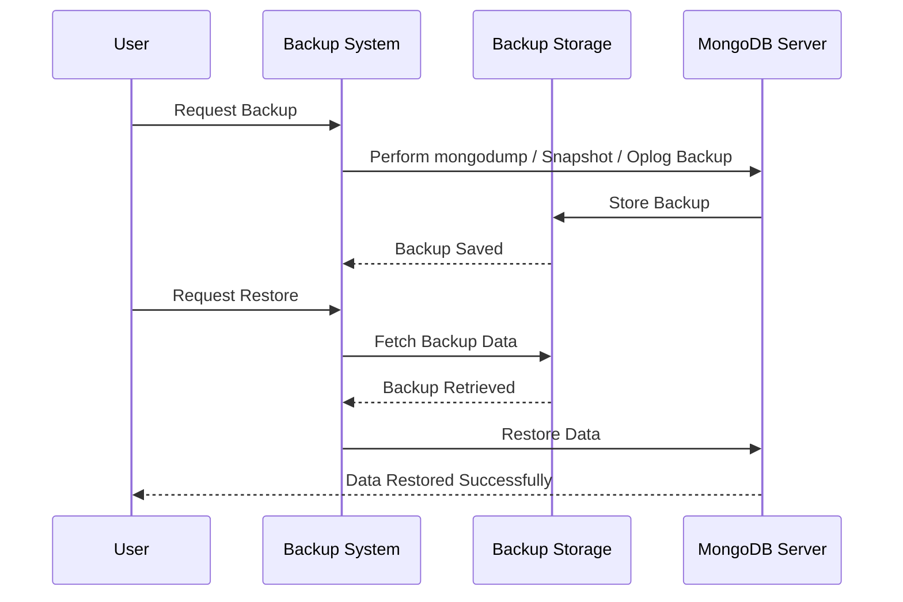

# **📦 MongoDB Backup & Disaster Recovery – Protecting Your Data 🚀**

Backups are **critical** to ensure **data is not lost due to crashes, corruption, accidental deletion, or cyberattacks**. MongoDB provides multiple methods for **backing up and restoring data**, each suitable for different **use cases**.

---

## **📦 1️⃣ Backup Strategies – Choosing the Right Method**

Not all backups are the same. The **right strategy** depends on factors like **database size, recovery time, and infrastructure**.

### **💡 Types of Backups in MongoDB**

| **Backup Type**                                   | **Best For**                   | **Pros**                        | **Cons**                        |
| ------------------------------------------------- | ------------------------------ | ------------------------------- | ------------------------------- |
| **Logical Backup (mongodump/mongorestore)**       | Small & Medium databases       | ✔️ Portable, Easy to Use        | ❌ Slow for large datasets      |
| **File System Snapshots**                         | Large databases, fast recovery | ✔️ Instant Backup, Fast Restore | ❌ Requires extra disk space    |
| **Oplog Backup**                                  | Continuous replication         | ✔️ Minimal data loss            | ❌ Needs replication            |
| **Cloud Backup (MongoDB Atlas, AWS, Azure, GCP)** | Managed environments           | ✔️ Automated, Scalable          | ❌ Requires internet connection |

✔️ **For small databases → Use `mongodump`**  
✔️ **For large databases → Use snapshots or oplog backups**  
✔️ **For real-time backups → Use oplog or cloud solutions**

---

## **🔄 2️⃣ MongoDB Backup Methods – Dump, Snapshots, Oplog & Cloud**

### **📌 Method 1: Logical Backup Using `mongodump` (Best for Small Databases)**

💡 **`mongodump` creates a JSON/BSON backup of your database.**

```bash
mongodump --db myDatabase --out /backups/mongo-backup
```

✔️ **Easy to use**  
✔️ **Portable format**  
❌ **Slow for large databases**

#### **🔄 Restore from `mongodump`**

```bash
mongorestore --db myDatabase /backups/mongo-backup
```

---

### **📌 Method 2: File System Snapshots (Best for Large Databases)**

💡 **Snapshots provide a fast backup method by copying database files at the filesystem level.**  
✔️ **Fastest backup method**  
✔️ **Best for large MongoDB deployments**  
❌ **Requires extra disk space**  
❌ **Can cause data inconsistency if not handled correctly**

#### **Steps to Take a Snapshot**

1️⃣ **Pause writes using `fsyncLock`**

```bash
db.fsyncLock()
```

2️⃣ **Create a file system snapshot (Linux LVM, AWS EBS, Azure, GCP Snapshots)**

```bash
lvcreate --snapshot --size 10G --name mongo-snapshot /dev/mongo_vg/mongo_lv
```

3️⃣ **Unlock writes after snapshot is taken**

```bash
db.fsyncUnlock()
```

4️⃣ **Store the snapshot for future recovery.**

✔️ **Restoring a snapshot is as simple as copying back the files.**

---

### **📌 Method 3: Oplog Backup (Best for Continuous Backup)**

💡 **The `oplog` (operations log) records all changes made to the database and can be used to restore to any point in time.**

✔️ **Ideal for replica sets**  
✔️ **Minimal data loss (Point-in-Time Recovery)**  
❌ **Requires extra disk space**  
❌ **Needs continuous oplog backups**

#### **Backup Oplog**

```bash
mongodump --db local --collection oplog.rs --out /backups/mongo-oplog
```

#### **Restore Oplog**

```bash
mongorestore --oplogReplay /backups/mongo-oplog
```

✔️ **Oplog allows recovery from specific timestamps, making it powerful for rollback scenarios.**

---

### **📌 Method 4: Cloud Backups (Best for Managed MongoDB)**

💡 **MongoDB Atlas, AWS, Azure, and GCP provide automated cloud backups.**

✔️ **Fully managed (No manual intervention needed)**  
✔️ **Scalable for large deployments**  
✔️ **Built-in disaster recovery**  
❌ **Requires internet & cloud infrastructure**

#### **Enabling Cloud Backups (MongoDB Atlas)**

```yaml
backups:
  enabled: true
  snapshotIntervalHours: 6
  retentionDays: 30
```

✔️ **Restoring from MongoDB Atlas is as simple as clicking a restore button.**

---

## **♻️ 3️⃣ MongoDB Restore Methods – How to Recover Data**

💡 **Restoring data depends on the backup method used.**

### **🔄 Restore from `mongodump`**

```bash
mongorestore --db myDatabase /backups/mongo-backup
```

### **🔄 Restore from File System Snapshot**

```bash
cp -r /snapshots/mongo-backup /var/lib/mongo
```

### **🔄 Restore from Oplog (Point-in-Time Recovery)**

```bash
mongorestore --oplogReplay /backups/mongo-oplog
```

✔️ **Choose the right restore method based on the backup you used.**

---

## **⚠️ 4️⃣ Disaster Recovery Planning – Handling Failures & Data Loss**

A **disaster recovery plan (DRP)** ensures that MongoDB can **recover from failures with minimal downtime**.

### **💡 Disaster Recovery Best Practices**

✔️ **Schedule automatic backups daily or weekly.**  
✔️ **Store backups in different locations (on-premises & cloud).**  
✔️ **Test recovery procedures regularly.**  
✔️ **Use replication to keep multiple copies of data.**  
✔️ **Use oplog for point-in-time recovery in case of corruption.**  
✔️ **Monitor database health using MongoDB Ops Manager or CloudWatch.**

---

## **🎯 5️⃣ Sequence Diagram – Backup & Restore Workflow**



💡 **Key Takeaways:**  
✔️ **Backups ensure data protection in case of failures.**  
✔️ **Restore strategies depend on the type of backup used.**  
✔️ **Testing recovery plans prevents downtime in critical situations.**

---

## **🏆 6️⃣ Summary – MongoDB Backup & Disaster Recovery Best Practices**

✔️ **Use `mongodump` for small databases & easy restores.**  
✔️ **Use filesystem snapshots for large databases with fast recovery.**  
✔️ **Use oplog backups for continuous replication & point-in-time recovery.**  
✔️ **Use cloud backups for automated, scalable backup solutions.**  
✔️ **Test backups regularly to ensure they work.**  
✔️ **Monitor MongoDB for signs of failure & corruption.**
