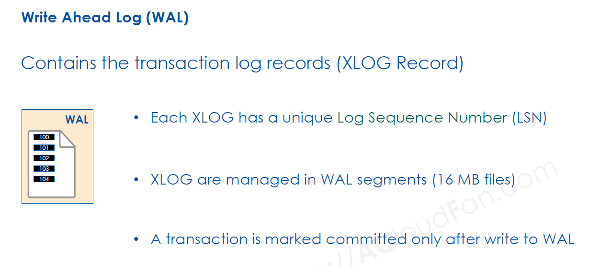
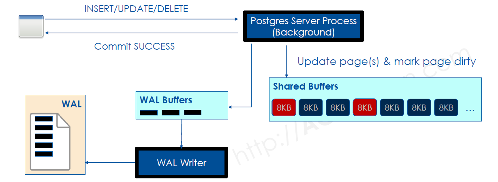
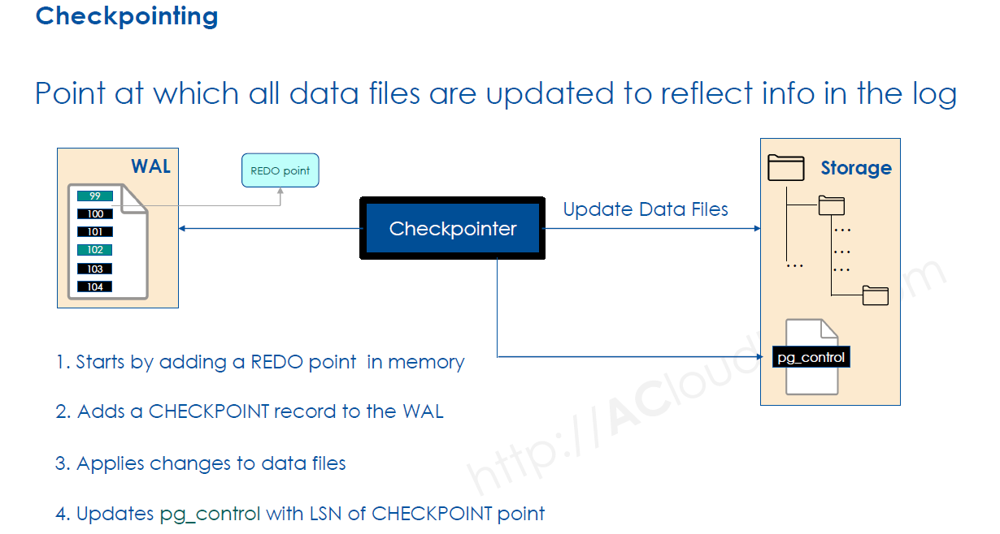
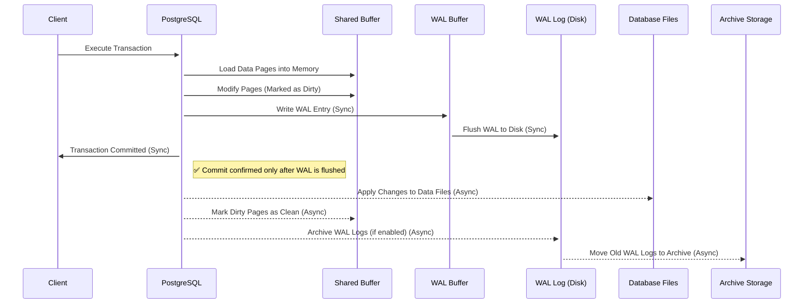

# 📝 Write-Ahead Logging (WAL) in PostgreSQL

Write-Ahead Logging (WAL) is a **crucial mechanism** in PostgreSQL that ensures **data integrity, durability, and crash recovery**. It helps prevent data loss by recording changes **before** they are applied to the actual database files. This makes **recovery** faster and more reliable.

---

<div style="text-align: center;">
    
</div>

---

<div style="text-align: center;">
    
</div>

---

## 🔍 What is WAL?

WAL is a **sequential logging system** where every database change is first written to a **log file (WAL log)** before updating the database itself.

### 🔹 Purpose of WAL

- ✅ Ensures **data consistency**
- ✅ Helps in **crash recovery**
- ✅ Improves **database performance** by avoiding frequent disk writes

💡 PostgreSQL follows the **"Write-Ahead"** principle:  
👉 Changes are **logged first** in WAL before applying them to actual database files.

---

## ⚙️ How WAL Works

### 1️⃣ **Logging Changes**

- When a **transaction** modifies the database, changes are **first recorded** in the WAL log.
- These changes are **not immediately** written to the actual database files.

### 2️⃣ **Flushing WAL Logs to Disk**

- WAL logs are **periodically flushed** (written) to disk to ensure they are safely stored.
- This ensures PostgreSQL can **replay logs** in case of a crash.

### 3️⃣ **Crash Recovery (REDO process)**

- Applies the WAL/XLOGs after the last checkpoint
- If PostgreSQL crashes, it uses WAL logs to **replay recorded changes**.
- This ensures that committed transactions are **not lost**, maintaining **data consistency**.
- Recovery time depends on number of pending XLOG

### 4️⃣ **WAL Archiving & Retention**

- **Archived WAL logs** are stored separately (e.g., **another disk or cloud storage**) for **backup and recovery**.
- This allows **Point-in-Time Recovery (PITR)**, where the database can be restored to a **specific moment** by replaying the archived WAL logs.
- PostgreSQL automatically **deletes old WAL logs** when they are no longer needed to **save disk space**.

---

## 🚀 Why WAL is Faster than Direct Writes?

### **1. Sequential I/O is Faster than Random I/O**

- Database files often involve random I/O operations. When changes need to be written to various parts of the database, the disk read/write heads have to move around to different locations. This process, known as seek time, is slow and can cause significant delays.
- On the other hand, WAL logs are written sequentially. The disk read/write heads only need to move forward in a continuous path, which is much faster and more efficient than random I/O.

> 💡 WAL logs are written sequentially, which is much faster than random writes to database files.

### **2. Batching Multiple Changes**

- Writing changes directly to the database files means that each individual change has to be written immediately, resulting in a high number of small, fragmented I/O operations.
- With WAL logging, multiple changes can be batched together and written to the WAL log in one go. This reduces the overall number of I/O operations and improves performance.

> 💡 WAL reduces write overhead by grouping multiple changes before writing them to disk.

### **3. Simplified Write Operations**

- Database files often require more complex write patterns, including updating multiple related tables, indexes, and maintaining data integrity constraints. This adds to the complexity and time required for each write operation.
- WAL logs have a simpler write pattern since they only record the changes in a sequential manner. This simplicity allows for faster write operations.

> 💡 Instead of modifying complex database structures immediately, WAL records changes in a simple log file.

### **4. Faster Crash Recovery**

- Writing to WAL logs first ensures that changes are recorded in a recoverable format. This way, if a crash occurs, the system can quickly replay the WAL logs to restore the database to a consistent state.
- If changes were written directly to the database files without a WAL, recovery from a crash would be much more complex and time-consuming.

> 💡 WAL replay ensures quick recovery instead of scanning the entire database.

---

## 🏗️ Components of WAL

WAL consists of **three key components**:

**1️⃣ WAL Buffer:**

- Temporary in-memory storage for WAL records before they are written to disk.

**2️⃣ WAL Segment Files:**

- Physical files on disk that store WAL records.
- Stored in the `pg_wal/` directory.

**3️⃣ WAL Checkpoints:**

- A point in the WAL log where all data files (database) are synchronized with the WAL log.
- Helps speed up recovery after a crash.
- PostgreSQL periodically creates checkpoints, where it ensures that all changes up to that point have been written to the database files. Between checkpoints, only the WAL logs are written to disk. This reduces the overall I/O load and helps in maintaining performance.

---

## 🔖 Checkpoint

A **checkpoint** in PostgreSQL is a **synchronization point** where all modified (dirty) pages in **shared buffers** are **flushed to disk**, ensuring data durability and allowing **WAL (Write-Ahead Log) cleanup**.

<div style="text-align: center;">
    
</div>

### 🔄 **How Checkpoints Work?**

1️⃣ PostgreSQL **accumulates changes** in **shared buffers**.  
2️⃣ WAL records **track changes** to ensure crash recovery.  
3️⃣ At a checkpoint, PostgreSQL:

- Writes all **dirty pages** to disk.
- Updates the **WAL Checkpoint Record**.
- Allows **WAL segments before the checkpoint to be removed**.

### 📏 **Checkpoint Frequency & Configuration**

Checkpoint frequency is controlled by **time-based and size-based triggers**:

| Parameter                      | Description                                              | Default |
| ------------------------------ | -------------------------------------------------------- | ------- |
| `checkpoint_timeout`           | Maximum time between checkpoints                         | `5min`  |
| `max_wal_size`                 | Maximum WAL size before forcing a checkpoint             | `1GB`   |
| `checkpoint_completion_target` | Spreads checkpoint writes over time to reduce I/O spikes | `0.9`   |

📌 **Example Configuration (for high-write workloads)**

```ini
checkpoint_timeout = 10min  # Less frequent, but larger checkpoints
max_wal_size = 2GB  # Allow more WAL accumulation before triggering a checkpoint
checkpoint_completion_target = 0.7  # Spread writes over 70% of checkpoint interval
```

### 🔧 **Optimizing Checkpoints**

✅ **Too Frequent Checkpoints?** Increase `max_wal_size` and `checkpoint_timeout` to reduce I/O overhead.  
✅ **High Write Workload?** Tune `checkpoint_completion_target` to **spread disk writes more evenly**.  
✅ **Monitoring Checkpoints**:

```sql
SELECT * FROM pg_stat_bgwriter;
```

## 🗄️ WAL Archiving & Retention

**WAL archiving** involves copying WAL files to a separate location (e.g., another disk or cloud storage) for **backup and recovery purposes**.

### 🔹 Why Archive WAL?

✅ Allows **Point-in-Time Recovery (PITR)** – Restore to a **specific time** by replaying WAL logs.  
✅ Ensures **disaster recovery** by keeping a copy of changes.  
✅ Helps **replication** in standby databases.

### 🔹 How Archiving Works?

1️⃣ WAL files are **automatically created** in PostgreSQL.  
2️⃣ The system copies WAL files to the **archive location**.  
3️⃣ Old WAL files are **removed** after they are no longer needed.

🔧 **Configuration Example** (in `postgresql.conf`):

```ini
archive_mode = on
archive_command = 'cp %p /path/to/archive/%f'
```

This command copies WAL files to `/path/to/archive/` for backup.

---

## 🔄 Sequence Diagram: WAL Process

Here is a **Mermaid sequence diagram** that explains how WAL works in PostgreSQL:



🔹 **Explanation**:

- **1️⃣** The **client** sends a transaction to PostgreSQL.
- **2️⃣** PostgreSQL first **writes the changes** to the **WAL Buffer**.
- **3️⃣** WAL Buffer **flushes** changes to the **WAL Log (Disk)**.
- **4️⃣** The actual database files are updated **later** (not immediately).
- **5️⃣** If **WAL archiving** is enabled, logs are stored in a separate location.
- **6️⃣** PostgreSQL sends a **commit confirmation** to the client.

---

## 🎯 Benefits of WAL

✅ **Prevents Data Loss** – Ensures changes are recorded before being written to database files.  
✅ **Speeds Up Recovery** – WAL logs allow PostgreSQL to recover quickly from crashes.  
✅ **Boosts Performance** – Uses **sequential writes**, which are faster than direct disk writes.  
✅ **Enables PITR (Point-in-Time Recovery)** – Restore the database to any moment in time.  
✅ **Supports Replication** – WAL logs can be used to sync standby databases.

---

## 📌 Key Takeaways

🔹 WAL ensures **data integrity** by writing changes **before** modifying database files.  
🔹 **Sequential writes** in WAL logs are **faster** than direct random writes.  
🔹 WAL supports **crash recovery**, **performance optimization**, and **archival backups**.  
🔹 PostgreSQL can **archive WAL logs** for **disaster recovery and PITR**.

📢 WAL is an **essential component** of PostgreSQL that keeps databases **safe, fast, and reliable**! 🚀
