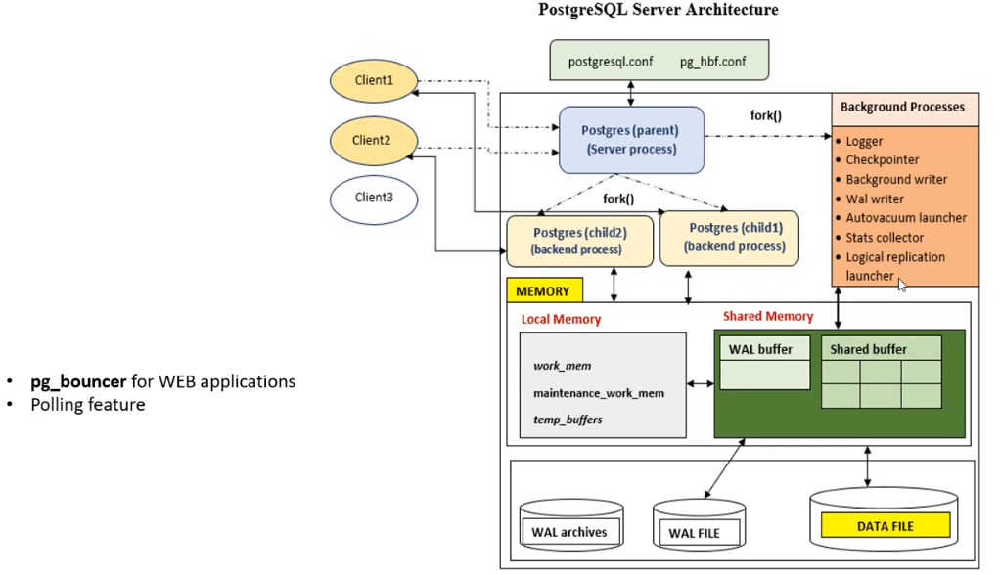
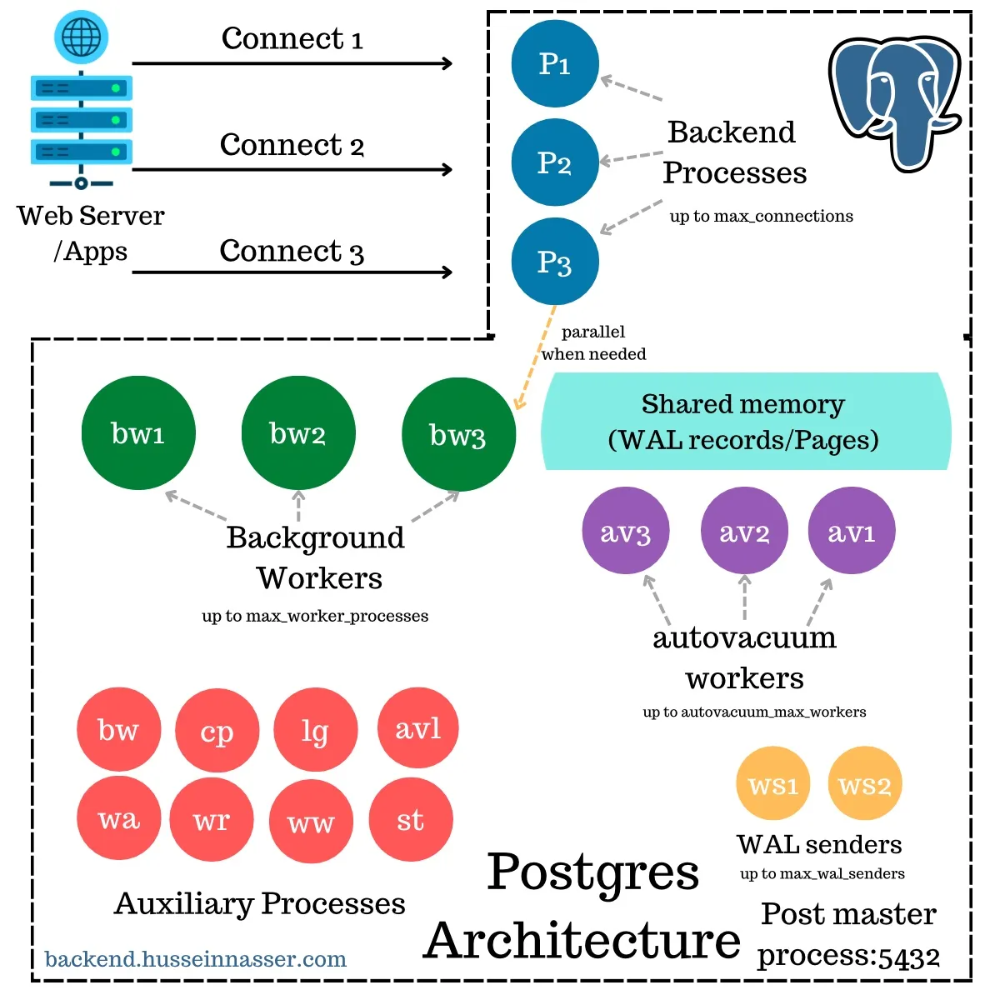

# 🚀 **PostgreSQL Architecture - A Deep Dive into Internals**

PostgreSQL is a **multi-process database system** that efficiently manages client connections, transactions, logging, memory, and background maintenance.

---

## 🏢 **Overview of PostgreSQL Architecture**

When a **client connects** (e.g., a web app or psql CLI), PostgreSQL handles it through several processes:

- **Postmaster Process**: The main process that manages database startup, authentication, and connection handling.
- **Backend Processes**: Separate processes assigned to each connected client to execute queries.
- **Shared Memory**: Where WAL (Write-Ahead Logging) and buffer pages reside.
- **Background Workers**: Perform additional tasks like indexing, parallel query execution, and logical replication.
- **Autovacuum Workers**: Maintain table health by clearing dead tuples.
- **WAL Senders & Receivers**: Ensure replication and streaming to standby servers.
- **Auxiliary Processes**: Responsible for tasks like logging, writing WAL files, and database recovery.

---

<div style="text-align: center;">
  
  
</div>

---

## 🔄 **PostgreSQL Processes vs Threads**

Unlike databases that use **thread-based** architectures (e.g., MySQL), PostgreSQL is **process-based**. Each client connection spawns a **separate process**, avoiding shared memory corruption but consuming more resources.

✅ **Why use processes over threads?**

- **Isolation**: If one process crashes, it doesn't affect others.
- **Security**: Process-based architecture avoids shared memory corruption.
- **Performance tradeoff**: While process-based systems are more robust, they consume more memory compared to thread-based databases.

---

## 🏠 **1. Postmaster Process (Parent Process)**

### 🔹 **What is the Postmaster Process?**

The **Postmaster Process** is the **main entry point** for PostgreSQL. It is responsible for:

- Handles new client connections.
- Restarts crashed backend processes.
- Manages shared memory allocation.
- Managing **backend processes** (user connections).

### 🔄 **How the Postmaster Works?**

- **1️⃣** The Postmaster listens on **port 5432** for new TCP connections.
- **2️⃣** When a new connection arrives, it:
  - **Authenticates the user** (password, certificates, Kerberos, etc.).
  - **Spawns a new Backend Process** (`postgres`).
- Passes the connection to the newly created process.

- **3️⃣** **If too many connections** occur, it **queues** them or rejects based on `max_connections`.

🔹 **Tuning Connection Handling:**

```ini
max_connections = 200  # Max allowed concurrent connections
superuser_reserved_connections = 5  # Reserved slots for superuser
```

> 🚀 Optimization: Use connection pooling (e.g., PgBouncer) instead of opening too many backend processes.

---

## 👤 **2. Backend Processes (User Connections)**

### 🔹 **What are Backend Processes?**

- When a **client (application, psql, or web server)** connects to PostgreSQL, the Postmaster creates a **separate backend process** for each connection.

- **Backend processes run independently** and **stay alive** as long as the user is connected.

### 🔄 **Backend Process Workflow**

- **1️⃣** The Postmaster accepts a new **client connection**.
- **2️⃣** It **forks a new backend process** (`postgres`) to handle the client’s queries.
- **3️⃣** The backend process:
  - Parses and **executes SQL queries**.
  - Maintains **transaction state**.
  - Reads/modifies data in **Shared Buffers**.
  - **Writes WAL logs** for durability.
- **4️⃣** When the client disconnects, the backend process is **terminated**.

🔹 **Backend processes interact heavily with:**

- **✅ Shared Buffers** → Caching data pages.
- **✅ WAL Logs** → Logging transaction changes.
- **✅ Locks & Concurrency Control** → Ensuring isolation levels.

---

## 🔄 **3. Shared Memory (Caching, WAL, Locking)**

PostgreSQL’s **Shared Memory** is where data pages and transaction logs are stored **temporarily in RAM**.

### 🔄 **Components of Shared Memory**

| Component                       | Description                                                    |
| ------------------------------- | -------------------------------------------------------------- |
| **Shared Buffers**              | Caches frequently accessed database pages.                     |
| **WAL Buffers**                 | Temporary storage for Write-Ahead Logs before writing to disk. |
| **Lock Table**                  | Stores row-level and table-level locks.                        |
| **Statistics Collector Memory** | Stores query execution statistics.                             |

### 🔄 **How PostgreSQL Uses Shared Memory?**

- **1️⃣** When a query requests data, PostgreSQL **first checks Shared Buffers**.
- **2️⃣** If the page **is present**, it is returned immediately.
- **3️⃣** If **not present**, PostgreSQL **fetches the page from disk** and stores it in Shared Buffers.
- **4️⃣** Modified pages are marked as **dirty pages** and later written to disk by the **Background Writer**.
- **5️⃣** WAL logs are temporarily stored in **WAL Buffers** before being flushed to disk.

🔹 **Key Parameters to Tune Shared Memory**

```ini
shared_buffers = 4GB  # In-memory cache for faster queries
wal_buffers = 16MB  # Buffer for write-ahead logs
work_mem = 64MB  # Memory allocated per query operation
```

### 📊 **Buffer Cache Hit Ratio in PostgreSQL**

#### 🔹 **What is Buffer Cache Hit Ratio?**

The **Buffer Cache Hit Ratio** measures how often queries retrieve data **from memory (shared buffers)** instead of disk. A **high ratio** means PostgreSQL is efficiently using RAM, reducing expensive disk I/O.

#### 🔄 **Formula for Buffer Cache Hit Ratio**

```sql
SELECT
  SUM(blks_hit) / NULLIF(SUM(blks_hit) + SUM(blks_read), 0) AS buffer_cache_hit_ratio
FROM pg_stat_database;
```

✅ **`blks_hit`** → Number of times PostgreSQL found data in shared buffers.  
✅ **`blks_read`** → Number of times PostgreSQL had to fetch data from disk.  
✅ **A ratio close to 1 (or 100%) is optimal.**

#### 📌 **How to Interpret the Results?**

| Buffer Cache Hit Ratio | Performance Impact                                         |
| ---------------------- | ---------------------------------------------------------- |
| **> 90%**              | ✅ Excellent – Most data is served from RAM.               |
| **70-90%**             | ⚠️ Good – Consider increasing `shared_buffers`.            |
| **< 70%**              | ❌ Poor – Too many disk reads; optimize queries & indexes. |

#### 🔧 **How to Improve Cache Hit Ratio?**

✅ **Increase `shared_buffers`** to allocate more RAM for caching:

```ini
shared_buffers = 4GB  # 25-40% of system RAM recommended
```

✅ **Optimize Queries & Index Usage** to reduce unnecessary disk reads.  
✅ **Use Connection Pooling** (PgBouncer) to prevent excessive backend process churn.  
✅ **Enable `pg_prewarm` Extension** to preload frequently accessed tables into memory.

---

## 🛠️ **4. Background Workers (Parallel Processing)**

### 🔹 **What are Background Workers?**

- Background workers **handle non-client tasks** (**asynchronous tasks**) like **parallel queries, maintenance, and replication**.
- When a complex query runs, PostgreSQL can split it into smaller tasks using Parallel Query Workers.

### 🔄 **Types of Background Workers**

| Worker                          | Function                                                             |
| ------------------------------- | -------------------------------------------------------------------- |
| **Parallel Query Workers**      | Used for **parallel execution** of queries.                          |
| **Logical Replication Workers** | Handles **logical replication** between databases.                   |
| **Extension Workers**           | Custom workers created by **extensions (Citus, TimescaleDB, etc.)**. |

🔹 **Configured via:**

```ini
max_worker_processes = 8  # Maximum parallel workers
```

---

## ⚙️ **5. Auxiliary Processes (System Tasks)**

Auxiliary processes handle **essential tasks** like logging, WAL management, and startup recovery.

| Process                     | Role                                             |
| --------------------------- | ------------------------------------------------ |
| **Background Writer (bw)**  | Writes dirty pages from Shared Buffers to disk.  |
| **Checkpointer (cp)**       | Triggers WAL checkpoints to persist data.        |
| **Logger (lg)**             | Logs PostgreSQL activity.                        |
| **WAL Archiver (wa)**       | Archives old WAL files.                          |
| **WAL Writer (wr)**         | Flushes WAL logs to disk.                        |
| **Startup Process (st) 🚀** | Runs after a crash to recover lost transactions. |

🔹 **Startup Process (Critical for Recovery):**

- **1️⃣** Reads the last **checkpoint**.
- **2️⃣** Applies **all uncommitted WAL records** to restore consistency.
- **3️⃣** Ensures **data durability before allowing new connections**.

### 🚀 Optimizing Checkpoints

```ini
checkpoint_timeout = 5min  # Reduce frequency of full checkpoints
max_wal_size = 2GB  # Control how much WAL accumulates before a checkpoint
```

---

## 🧹 **6. Autovacuum Workers (Table Optimization)**

### 🔹 **Why is Autovacuum Needed?**

PostgreSQL **never overwrites old rows**. Instead, **it marks them as dead tuples**, Without cleaning, the database becomes **bloated**.

### 🔄 **How Autovacuum Works?**

- **1️⃣** The **Autovacuum Launcher (avl)** monitors detects tables with **dead tuples**.
- **2️⃣** It spawns **Autovacuum Workers (av1, av2, …)** reclaim space.
- **3️⃣** The worker runs `VACUUM`, freeing up space for new data.

🔹 **Configuration Example**

```ini
autovacuum = on  # Enable automatic cleanup
autovacuum_vacuum_threshold = 50  # Trigger vacuum if >50 dead tuples
autovacuum_vacuum_scale_factor = 0.2  # Vacuum when 20% of rows are dead
autovacuum_vacuum_cost_limit = 2000  # Control I/O impact
```

---

## 🔄 **7. WAL Senders (Streaming Replication)**

### 🔹 **What are WAL Senders?**

WAL Senders (`ws1`, `ws2`) **stream WAL logs** to **replica servers** for **real-time replication**.

### 🔄 **Streaming Replication Process**

- **1️⃣** **WAL logs** are generated on the **primary database**.
- **2️⃣** **WAL Senders** stream WAL logs to **standby servers**.
- **3️⃣** Standby servers apply WAL logs, keeping them in **sync**.

🔹 **Configured via:**

```ini
wal_level = replica  # Enable WAL for replication
max_wal_senders = 5  # Allow up to 5 replicas
synchronous_commit = on  # Ensure data is committed on standby
```
