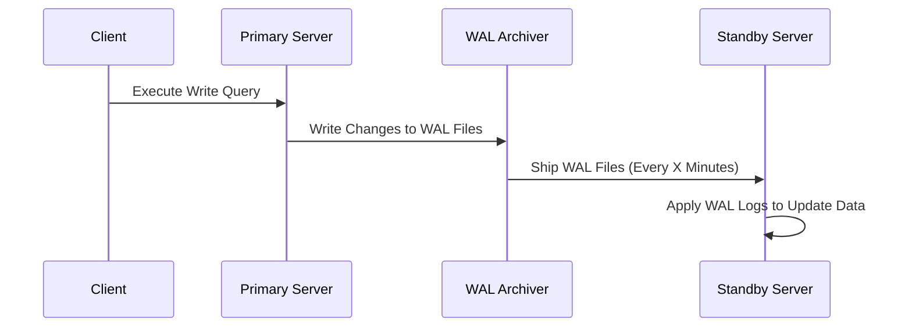
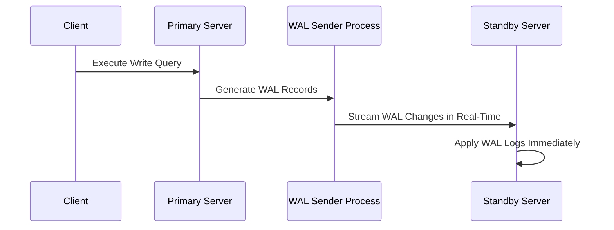
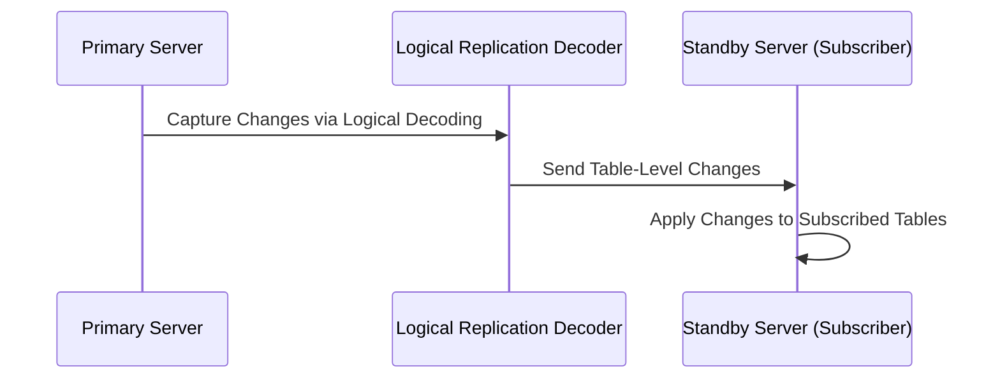
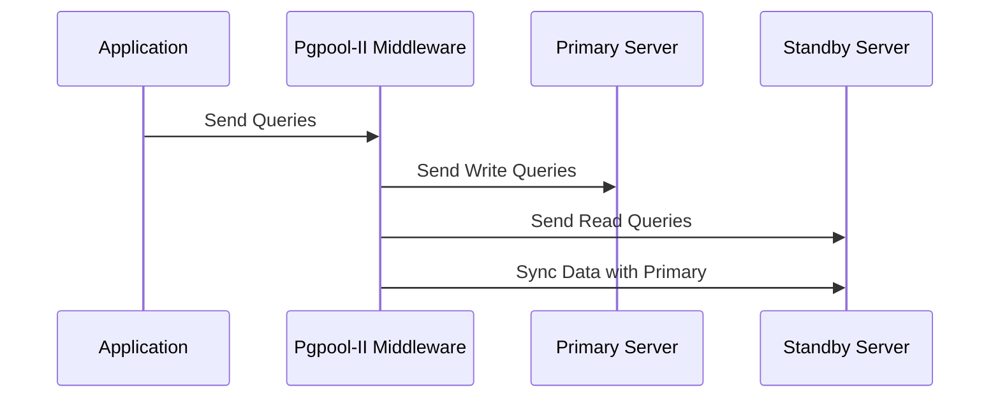

# 🐘 **PostgreSQL Replication Solutions – In Depth**

Replication in PostgreSQL ensures that data is synchronized across multiple servers, enhancing **high availability, fault tolerance, and disaster recovery**. Different replication methods exist, each serving different use cases.

---

## 📌 **1️⃣ Understanding Replication in PostgreSQL**

Replication is the process of copying and maintaining database objects from one database server (**primary**) to another (**standby**) in real-time or near-real-time.

✅ **Why Replication?**

- **High Availability**: Ensures redundancy in case of failures.
- **Load Balancing**: Read queries can be offloaded to standby servers.
- **Disaster Recovery**: Standby servers provide a fallback in case of failures.
- **Upgrades & Migrations**: Can be used to upgrade PostgreSQL with minimal downtime.

🛠 **Types of Replication in PostgreSQL**

1. **Write-Ahead Log (WAL) Shipping**
2. **Streaming Replication**
3. **Logical Replication**
4. **SQL-Based Replication Middleware (Pgpool-II)**

---

## 🚀 **2️⃣ Write-Ahead Log (WAL) Shipping**

**Concept**:

- WAL files (binary logs of changes) are periodically copied from the **primary** server to the **standby** server.
- Standby applies the WAL changes to keep in sync.
- **No real-time streaming**; replication happens in **intervals**.

✅ **Pros**:

- Simple and reliable.
- Low bandwidth usage.
- Good for **disaster recovery**.

❌ **Cons**:

- Delay between log shipping and recovery.
- Cannot accept **read queries** unless configured with **hot standby**.

📌 **How WAL Shipping Works (Sequence Diagram)**



📌 **Configuration Steps**

1. Enable **archive_mode** in `postgresql.conf`:

   ```ini
   archive_mode = on
   archive_command = 'cp %p /var/lib/postgresql/wal_archive/%f'
   ```

2. On the **standby server**, restore WAL files:

   ```ini
   restore_command = 'cp /var/lib/postgresql/wal_archive/%f %p'
   ```

---

## 🔄 **3️⃣ Streaming Replication**

**Concept**:

- Uses **WAL streaming** to replicate changes in **real-time**.
- Standby continuously receives WAL records from the primary.
- Can be **synchronous** (zero data loss) or **asynchronous** (minimal lag).

✅ **Pros**:

- Faster than WAL Shipping (real-time updates).
- Supports **read queries** with **Hot Standby**.

❌ **Cons**:

- Requires more **network bandwidth**.
- In **synchronous mode**, performance impact if standby is slow.

📌 **How Streaming Replication Works (Sequence Diagram)**



📌 **Configuration Steps**

1. On the **primary server**, enable replication:

   ```ini
   wal_level = replica
   max_wal_senders = 5
   synchronous_commit = on
   ```

2. On the **standby server**, create `recovery.conf`:

   ```ini
   primary_conninfo = 'host=primary_ip user=replication password=secret'
   standby_mode = on
   ```

---

## 🔀 **4️⃣ Logical Replication**

**Concept**:

- **Table-level replication** rather than entire database.
- Uses **logical decoding** to extract changes and apply them to the subscriber.
- Used for **migrations, cross-version replication, and partial replication**.

✅ **Pros**:

- Replicate **only specific tables**.
- Works across **different PostgreSQL versions**.
- Supports **bi-directional replication**.

❌ **Cons**:

- Slower than Streaming Replication (since it decodes SQL changes).
- Requires **conflict resolution** if used for write/write setups.

📌 **How Logical Replication Works (Sequence Diagram)**



📌 **Configuration Steps**

1. Enable **logical replication** in `postgresql.conf`:

   ```ini
   wal_level = logical
   ```

2. Create **publication** on primary:

   ```sql
   CREATE PUBLICATION my_pub FOR TABLE users;
   ```

3. On the **standby server**, create **subscription**:

   ```sql
   CREATE SUBSCRIPTION my_sub CONNECTION 'host=primary user=replication password=secret' PUBLICATION my_pub;
   ```

---

## ⚡ **5️⃣ SQL-Based Replication Middleware (Pgpool-II)**

**Concept**:

- Middleware that sits **between** applications and PostgreSQL servers.
- Handles **load balancing**, **connection pooling**, and **replication**.
- Supports **failover** and **read query scaling**.

✅ **Pros**:

- Load balancing for read queries.
- Works **without modifying PostgreSQL itself**.
- Manages **failover** automatically.

❌ **Cons**:

- Adds an **extra layer** in the architecture.
- Requires **careful tuning** to avoid performance bottlenecks.

📌 **How Pgpool-II Works (Sequence Diagram)**



📌 **Configuration Steps**

1. Install **Pgpool-II**:

   ```bash
   sudo apt install pgpool2
   ```

2. Edit `pgpool.conf` to enable **load balancing**:

   ```ini
   load_balance_mode = on
   ```

3. Set up **replication mode**:

   ```ini
   replicate_select = on
   ```

---

## 🎯 **Final Comparison of Replication Methods**

| Feature              | WAL Shipping            | Streaming Replication    | Logical Replication   | Pgpool-II                 |
| -------------------- | ----------------------- | ------------------------ | --------------------- | ------------------------- |
| **Replication Type** | Physical (File-based)   | Physical (WAL Streaming) | Logical (SQL Changes) | Middleware-Based          |
| **Granularity**      | Full DB                 | Full DB                  | Table-Level           | Full DB                   |
| **Real-Time?**       | No                      | Yes                      | Yes                   | Yes                       |
| **Read Queries?**    | No (unless hot standby) | Yes                      | Yes                   | Yes                       |
| **Use Case**         | Disaster Recovery       | High Availability        | Data Migrations       | Load Balancing & Failover |

---

## ✅ **Final Summary**

🔹 **WAL Shipping** → Simple, reliable, but **not real-time**.  
🔹 **Streaming Replication** → Best for **real-time replication** and HA.  
🔹 **Logical Replication** → Great for **partial replication & migrations**.  
🔹 **Pgpool-II** → Load balancing & automatic failover.

💡 **Next, we will explore the setup and configuration for each replication type! 🚀🔥**
