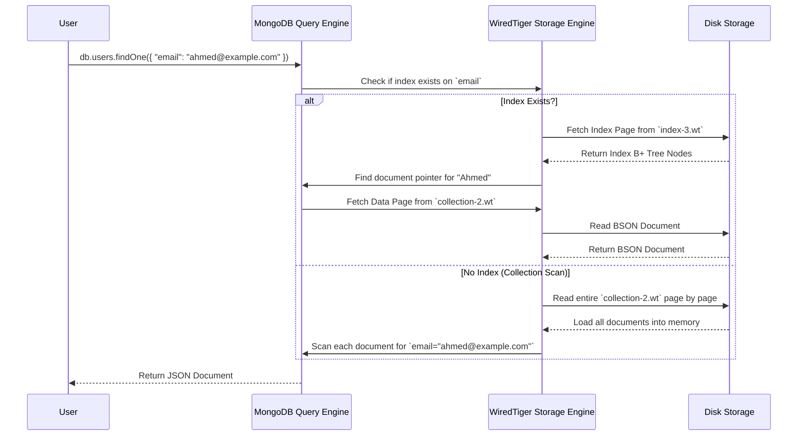

# 📌 **Deep Dive into Indexing in DocumentDB (MongoDB) – How It Works Internally 🚀**

Indexing is **one of the most important** optimization techniques in **MongoDB (AWS DocumentDB)**. Without indexes, MongoDB must **scan every document in a collection** to find the matching results, which **is slow and inefficient**.

---

## 🛠️ **1️⃣ What is Indexing & Why It Matters?**

An **index** is a **special data structure** that **stores a mapping** between a field’s values and the locations of corresponding documents.

✅ **Indexing improves query speed** by reducing the number of documents that MongoDB needs to scan.  
✅ **Without an index, MongoDB performs a full collection scan** (equivalent to SQL Table Scan).  
✅ **With an index, MongoDB performs an Index Seek or Index Scan** (like SQL Index Seek).

📌 **Example Without an Index:**

```json
db.users.findOne({ "email": "ahmed@example.com" })
```

🚨 **Slow Query!** MongoDB must **scan every document** in the collection to find the match.

📌 **Example With an Index:**

```json
db.users.createIndex({ "email": 1 })
db.users.findOne({ "email": "ahmed@example.com" })
```

✅ **Faster Query!** The index allows MongoDB to **jump directly to the matching document** instead of scanning all documents.

---

## 🏗️ **2️⃣ Types of Indexes in DocumentDB**

MongoDB supports **several types of indexes**, each optimized for different query patterns.

### **1️⃣ Single-Field Index**

- Indexes a **single field** for **fast lookups**.
- **Example:** Index on `email`

```json
db.users.createIndex({ "email": 1 })
```

✅ **Best for:** Lookups on a single field (`db.users.findOne({ "email": "ahmed@example.com" })`).

---

### **2️⃣ Compound Index**

- Indexes **multiple fields together**.
- **Example:** Index on `name` and `age`

```json
db.users.createIndex({ "name": 1, "age": -1 })
```

✅ **Best for:** Queries that filter on **both `name` and `age`** together.

📌 **Important:** **Order matters!** The query must use the fields in the same **left-to-right order** for best performance.

---

### **3️⃣ Multi-Key Index**

- **Indexes arrays** (when a field contains an array).
- **Example:** Index on `tags` (an array field)

```json
db.posts.createIndex({ "tags": 1 })
```

> ✔️ **Best for:** Queries searching inside arrays (`db.posts.find({ "tags": "mongodb" })`).
>
> 🚨 **Note:** **Multi-key indexes can’t be used for sorting** when combined with another field.

---

### **4️⃣ Text Index**

- **Used for full-text search** (searching words inside text fields).
- **Example:**

```json
db.articles.createIndex({ "content": "text" })
```

> ✔️ **Best for:** Searching blog posts, comments, or product descriptions.

```json
db.articles.find({ "$text": { "$search": "database indexing" } })
```

> 🚨 **Note:** **Text indexes don’t support sorting** (you can’t combine full-text search with sorting efficiently).

---

### **5️⃣ Hashed Index**

- **Uses a hash function** instead of storing values in sorted order.
- **Example:** Index on `_id`

```json
db.users.createIndex({ "_id": "hashed" })
```

> ✔️ **Best for:** **Sharding (evenly distributing data)** across multiple servers.
>
> 🚨 **Note:** **Hashed indexes don’t support range queries** (`$lt`, `$gt`, `$between`).

---

### **6️⃣ Wildcard Index**

- **Indexes all fields dynamically**.
- **Example:** Index on all fields

```json
db.collection.createIndex({ "$**": 1 })
```

> ✔️ **Best for:** **Dynamic schemas** (when you don’t know in advance which fields need to be indexed).

🚨 **Note:** **Wildcard indexes can use more storage** than specific indexes.

---

## ⚙️ **3️⃣ How Indexing Works Internally in WiredTiger**

MongoDB uses **WiredTiger** as its default storage engine, which stores **indexes separately** from document data.

📂 **MongoDB File Structure:**

```in
/data/db/
  ├── collection-2.wt  # Data File (Stores Documents)
  ├── index-3.wt       # Index File (Stores Indexes)
  ├── WiredTigerLog.*  # Write-Ahead Log
```

📌 **Indexes are stored as B+ Trees inside `index-*.wt` files.**  
📌 **Data is stored in BSON format inside `collection-*.wt` files.**

### **🔍 How Indexes Store Data (B+ Tree Structure)**

```ini
        [Root Node]
            |
    ------------------
    |       |       |
  Ahmed   Hady    Mohamed
    ↓        ↓         ↓
[Doc1]   [Doc2]   [Doc3]
```

> ✔️ **Index nodes store field values and pointers to documents in the Data Pages.**

---

## 📊 **4️⃣ Indexing Performance Trade-offs & Best Practices**

| **Best Practice**                             | **Why?**                                      |
| --------------------------------------------- | --------------------------------------------- |
| **Index frequently searched fields**          | Speeds up query performance.                  |
| **Use Compound Indexes for multiple filters** | Avoids multiple index scans.                  |
| **Don’t index every field**                   | Indexes consume extra storage & slow inserts. |
| **Use Covered Queries**                       | Reduces need to fetch documents.              |
| **Use Hashed Indexes for Sharding**           | Distributes data evenly across shards.        |

🚨 **Too many indexes slow down writes!** **Each insert must update all indexes.**

---

## 🖼️ **5️⃣ Sequence Diagram: How Index-Based Queries Work**



📌 **Key Takeaways from the Diagram**  
✔ **Indexes allow MongoDB to quickly locate documents, avoiding full collection scans.**  
✔ **Without an index, MongoDB must scan every document, making queries slow.**

---

## 🏁 **Final Takeaways**

🔥 **Indexes are essential for performance in DocumentDB (MongoDB).**  
🔥 **Use Compound & Covered Indexes for complex queries.**  
🔥 **Avoid excessive indexing, as it impacts write performance.**  
🔥 **Hashed Indexes help with sharding, but don’t support range queries.**  
🔥 **WiredTiger stores indexes separately in `.wt` files for fast lookups.**

💡 **Next Topic?** Want a deep dive into **how Write-Ahead Logging (WAL) and journaling work in WiredTiger? 🚀🔥**
