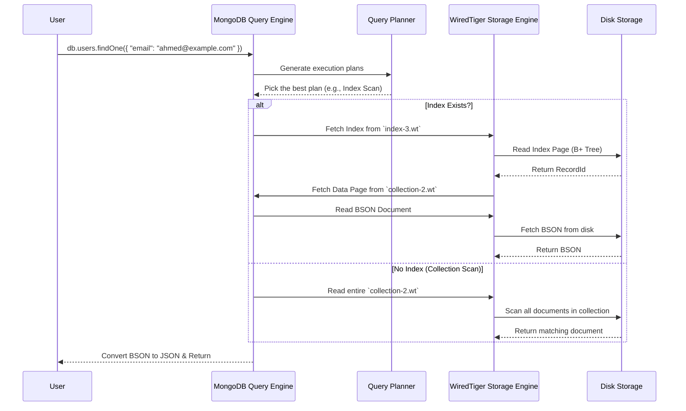

# **🔍 MongoDB Internals – How Queries Are Executed (Query Planner, Execution Plan, Index Selection) 🚀**

Now that we've covered **how MongoDB stores and retrieves data**, let's dive into **how queries are processed internally**.

💡 **What happens when you run a query in MongoDB?**  
MongoDB **doesn't just scan everything**—it uses an intelligent system called the **Query Planner** to **find the fastest way** to get your data.

---

## **🛠️ 1️⃣ How MongoDB Processes Queries (Step-by-Step)**

When you run a query, **MongoDB doesn't just fetch data immediately**—it follows a structured process:

💡 **Example Query:**

```json
db.users.findOne({ "email": "ahmed@example.com" })
```

💡 **What Happens Internally?**

| Step                                           | Description                                                                |
| ---------------------------------------------- | -------------------------------------------------------------------------- |
| **1️⃣ Parse Query**                             | MongoDB **parses the query** to check for syntax errors.                   |
| **2️⃣ Check Cache (if enabled)**                | If the **same query was recently run**, MongoDB may return cached results. |
| **3️⃣ Query Planner Generates Execution Plans** | MongoDB **creates multiple possible ways** to fetch the data.              |
| **4️⃣ Query Optimizer Chooses the Best Plan**   | MongoDB picks the **fastest execution plan**.                              |
| **5️⃣ Query Engine Executes the Plan**          | The query engine **fetches the documents from storage (WiredTiger)**.      |
| **6️⃣ BSON → JSON Conversion**                  | The BSON documents are converted back into JSON.                           |
| **7️⃣ Return Results**                          | The JSON result is sent to the user.                                       |

---

## **📊 2️⃣ The Query Planner & Execution Plan**

MongoDB **doesn't execute a query blindly**—it **analyzes multiple plans** and picks the best one.

### **💡 What is an Execution Plan?**

An **Execution Plan** is a **detailed set of steps** that MongoDB follows to retrieve data.

MongoDB generates **multiple execution plans** and picks the one with the **lowest cost** (fastest execution).

💡 **Example Execution Plan for `findOne({ "email": "ahmed@example.com" })`**

| **Execution Plan**                | **Description**                                               | **Query Cost**        |
| --------------------------------- | ------------------------------------------------------------- | --------------------- |
| **Plan 1: Collection Scan**       | Reads every document in the collection **(Slow 🚨)**          | ❌ High               |
| **Plan 2: Index Scan on `email`** | Uses an **index on `email`** to jump directly to the document | ✔️ Low                |
| **Plan 3: Covered Index Query**   | Uses an index that **contains all required fields**           | ✅ **Best (Fastest)** |

✔️ **MongoDB picks the plan with the lowest query cost** (fewer disk reads).

---

## **⚡ 3️⃣ Index Selection & Query Optimization**

MongoDB **automatically decides whether to use an index** based on query patterns.

### **💡 How MongoDB Selects an Index**

**1️⃣ MongoDB checks if an index exists for the query field(s).**  
**2️⃣ It looks at the index statistics (size, uniqueness, usage).**  
**3️⃣ It picks the index that results in the fewest document scans.**

💡 **Example Query with Index:**

```json
db.users.findOne({ "email": "ahmed@example.com" })
```

If an index exists on `email`, MongoDB **skips scanning all documents** and goes directly to the correct document.

✔️ **With Index:**

```ini
Index B+ Tree → Jump to Document → Return Result (Fast)
```

❌ **Without Index:**

```ini
Scan All Documents → Compare Each One → Return Result (Slow)
```

💡 **When Does MongoDB Avoid Indexes?**
✔️ **If an index exists, MongoDB will use it.**  
❌ **If an index does NOT exist, MongoDB will do a full collection scan.**

---

## **💾 4️⃣ How Queries Use the Storage Engine (WiredTiger)**

Once the **Query Planner picks an execution plan**, MongoDB **fetches data from storage (WiredTiger).**

💡 **Query Execution Flow in WiredTiger**

| Step                          | Description                                                       |
| ----------------------------- | ----------------------------------------------------------------- |
| **1️⃣ Check Index**            | If an index is used, MongoDB searches the B+ Tree index file.     |
| **2️⃣ Fetch Document Pointer** | The index **points to the exact RecordId** of the document.       |
| **3️⃣ Fetch BSON Document**    | WiredTiger reads the document **from the collection `.wt` file**. |
| **4️⃣ Convert BSON to JSON**   | The result is converted and returned to the user.                 |

✔️ **With Indexes, MongoDB only loads the required documents.**  
❌ **Without Indexes, MongoDB loads the entire collection.**

---

### **🎯 5️⃣ Sequence Diagram: Query Execution in MongoDB**



💡 **Key Takeaways from the Diagram:**  
✔️ **MongoDB generates multiple execution plans** and picks the fastest one.  
✔️ **Indexes speed up queries by avoiding full collection scans.**  
✔️ **WiredTiger fetches data using RecordId, avoiding inefficient disk scans.**

---

## **🏆 6️⃣ Summary – How MongoDB Executes Queries**

✔️ **MongoDB parses the query & generates multiple execution plans.**  
✔️ **It picks the plan with the lowest cost (fastest execution).**  
✔️ **If an index exists, MongoDB uses it to fetch data quickly.**  
✔️ **If no index exists, MongoDB does a full collection scan (slow).**  
✔️ **WiredTiger retrieves documents efficiently using RecordId.**

> 💡 **Indexes are crucial for performance! Always create indexes on frequently queried fields.**
