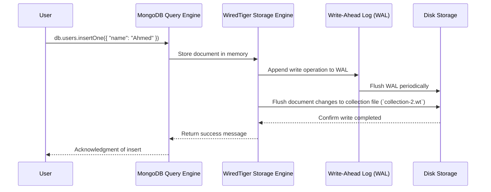

# **🔍 MongoDB Internals – How WiredTiger Handles Writes, Updates & Journaling 🚀**

Now that we've covered **how MongoDB executes queries**, let's dive into **how MongoDB handles writes, updates, and durability using WiredTiger**.

💡 **What happens when MongoDB inserts, updates, or deletes a document?**  
MongoDB **doesn't immediately write data to disk**—it uses techniques like **MVCC (Multi-Version Concurrency Control)** and **Write-Ahead Logging (WAL)** to optimize performance and ensure data durability.

---

## **🛠️ 1️⃣ How MongoDB Handles Writes & Updates**

💡 **MongoDB writes are not immediately stored on disk**. Instead, they follow this process:

✔️ **1. The client sends a write request.**  
✔️ **2. MongoDB first writes the document to WiredTiger's in-memory cache.**  
✔️ **3. The write is added to the Write-Ahead Log (WAL), also called a journal.**  
✔️ **4. Periodically, MongoDB flushes the WAL to disk (commit).**  
✔️ **5. If a crash happens, MongoDB can recover the data using the WAL.**

---

**💡 Example Write Operation:**

```json
db.users.insertOne({ "name": "Ahmed", "email": "ahmed@example.com" })
```

> 💡 **MongoDB doesn't write this immediately to disk.**  
> Instead, it **buffers the write in memory and logs it in the journal first**.

---

## **🔄 2️⃣ Multi-Version Concurrency Control (MVCC) & Journaling**

💡 **What is MVCC (Multi-Version Concurrency Control)?**  
MVCC allows **multiple clients to read and write at the same time** **without blocking each other**.

### **💡 How MVCC Works in MongoDB**

✔️ **Each write creates a new version of a document in memory.**  
✔️ **Readers see the "old" version while the write is in progress.**  
✔️ **Once the write is committed, new readers see the updated version.**

---

## **🔍 3️⃣ Write-Ahead Logging (WAL) – Ensuring Durability**

💡 **MongoDB uses WAL (Write-Ahead Logging) to prevent data loss.**  
Instead of **immediately updating files on disk**, MongoDB **first writes changes to a journal log.**

### **💡 Why Use WAL?**

✔️ **Faster Writes** – Writing to a log file is faster than modifying data files directly.  
✔️ **Crash Recovery** – If MongoDB crashes, it can **replay the journal log** to recover lost writes.  
✔️ **Atomicity** – Ensures **all or nothing** updates (transactions).

### **💡 WAL Process in MongoDB**

**1️⃣ Write operation is received.**  
**2️⃣ Data is stored in memory.**  
**3️⃣ The write is added to the WAL (journal).**  
**4️⃣ After a few seconds, MongoDB flushes WAL changes to the main database file.**

---

## **🎯 4️⃣ Sequence Diagram: Write Operation in MongoDB**



💡 **Key Takeaways from the Diagram:**  
✔️ **Writes are first stored in memory.**  
✔️ **Changes are logged in the WAL (journal) before being written to disk.**  
✔️ **MongoDB periodically commits WAL changes to the database file.**

---

## **🏆 5️⃣ Summary – How MongoDB Handles Writes & Updates**

✔️ **MongoDB buffers writes in memory before writing to disk.**  
✔️ **MVCC allows multiple reads/writes without conflicts.**  
✔️ **Writes are logged in the WAL before being committed.**  
✔️ **Journal logs help recover data in case of crashes.**  
✔️ **Flushing writes in batches improves performance.**
