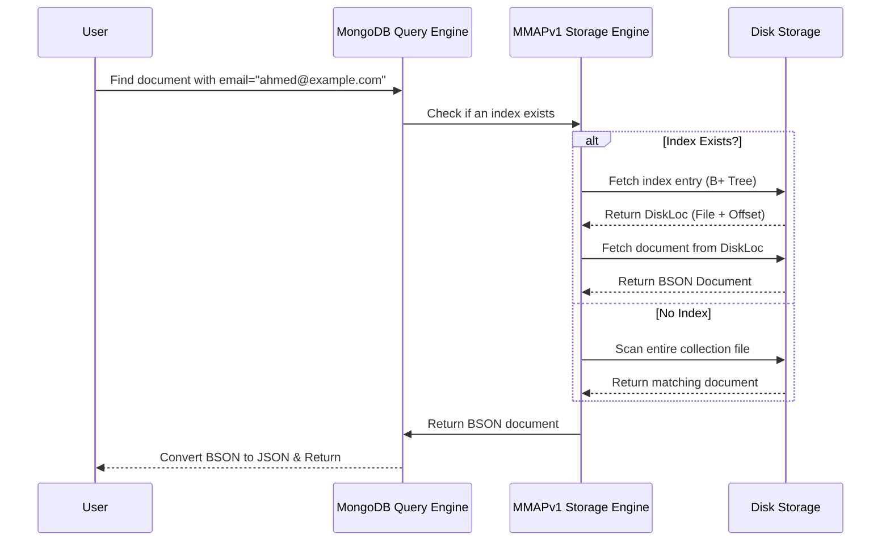
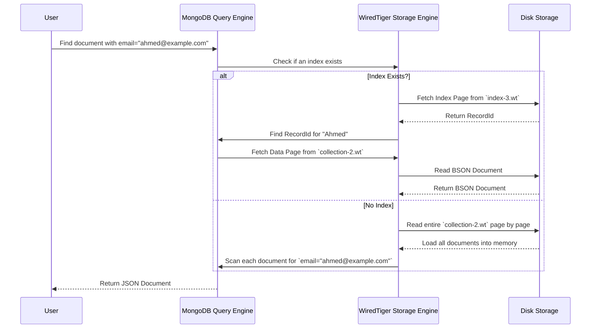

# **🔍 MongoDB Internals – Storage Engine Evolution (MMAPv1 vs. WiredTiger) Simplified 🚀**

MongoDB has evolved significantly in how it **stores and retrieves data**. It started with **MMAPv1**, which had major limitations, and later moved to **WiredTiger**, which is now the default storage engine.

This guide will **explain the evolution of MongoDB storage engines in detail, using simple terms and diagrams** so you can fully understand how **documents are stored, retrieved, and indexed**.

---

## **🛠️ 1️⃣ What is a Storage Engine?**

A **storage engine** is the **core part of the database** that decides **how data is written to and read from the disk**. Every database (MySQL, PostgreSQL, MongoDB) has a **storage engine** that handles:

✔️ **How data is structured on disk (tables, indexes, documents, etc.)**  
✔️ **How queries are processed efficiently**  
✔️ **How updates and deletes modify data on disk**  
✔️ **How multiple users can read/write at the same time without conflicts**

---

## **💾 2️⃣ MMAPv1 – The First MongoDB Storage Engine (Pre-3.2)**

**MMAPv1 (Memory-Mapped Files)** was MongoDB’s **original storage engine**, but it had several issues:

✔️ It used **memory-mapped files**, meaning it relied on the **operating system (OS) to read/write data**.  
✔️ Documents were stored **directly on disk in BSON format (uncompressed)**.  
✔️ Every document had a **DiskLoc** (file + offset) that pointed to where the document was stored on disk.  
✔️ If a document was updated and got **bigger**, it had to be **moved to a new location**, causing fragmentation.  
✔️ **Writes were slow** because MongoDB **locked the entire database** when updating.

---

### **💡 How MMAPv1 Stored Data**

MMAPv1 stored **every document at a specific location on disk**, identified by a **DiskLoc**.

#### **📌 What is DiskLoc?**

DiskLoc is a **pair of numbers** that tells MongoDB **where a document is stored on disk**.

| **DiskLoc Structure** | **Meaning**                                                              |
| --------------------- | ------------------------------------------------------------------------ |
| **File Number** 🗂️    | Identifies which data file the document is in (e.g., `collection-2.wt`). |
| **Offset** 📍         | The exact **position (byte offset)** of the document inside the file.    |

💡 **Think of DiskLoc like a book reference:**

- **File Number** = Which book 📚
- **Offset** = Page & line number 📖

Example:

```json
DiskLoc: { file: 3, offset: 45678 }
```

- This means the document is **stored inside file number 3**, starting at **byte 45,678**.

---

### **🔍 How MMAPv1 Executed Queries**

When a user runs:

```json
db.users.findOne({ "email": "ahmed@example.com" })
```

MongoDB follows these steps:



💡 **Problems with MMAPv1:**  
❌ **Fragmentation** – If documents grow, they need to be moved, breaking DiskLoc.  
❌ **Single Global Lock** – Only **one write operation** could happen at a time.  
❌ **No Compression** – All documents were stored **uncompressed**, wasting disk space.

🔴 **Solution:** **MongoDB replaced MMAPv1 with WiredTiger in version 3.2**.

---

## **⚙️ 3️⃣ WiredTiger – MongoDB’s Default Storage Engine (3.2+)**

**In MongoDB 3.2, WiredTiger replaced MMAPv1** to improve:

✔️ **Performance** – Uses **document-level locking** (multiple users can write at the same time).  
✔️ **Storage Efficiency** – Compresses documents (Snappy/Zlib).  
✔️ **Index Optimization** – Uses **B+ Trees** instead of DiskLoc.

💡 **Major Change:**

- **No more DiskLoc** (file + offset).
- Instead, MongoDB assigns each document a **RecordId (a unique 64-bit integer).**

---

### **💡 What is RecordId?**

A **RecordId** is a **64-bit integer** (instead of DiskLoc) that uniquely identifies a document.

💡 **Why is RecordId better than DiskLoc?**
✔️ **Doesn’t break when documents grow** (unlike DiskLoc).  
✔️ **Allows WiredTiger to store data more efficiently**.  
✔️ **Indexes now point to RecordId instead of file + offset.**

Example:

```json
RecordId: 1234567890
```

- This means the document **can be stored anywhere**, and MongoDB can still find it quickly.

---

### **🔍 How WiredTiger Executes Queries**

Now, when a user runs:

```json
db.users.findOne({ "email": "ahmed@example.com" })
```

MongoDB follows these steps:



💡 **Key Takeaways:**  
✔️ **WiredTiger uses RecordId instead of DiskLoc for fast lookups.**  
✔️ **Documents are stored compressed, reducing disk usage.**  
✔️ **Index lookups are more efficient, making queries faster.**

---

## **🏆 4️⃣ MMAPv1 vs. WiredTiger – Key Differences**

| Feature                | MMAPv1 (Old)                               | WiredTiger (New)                 |
| ---------------------- | ------------------------------------------ | -------------------------------- |
| **Document Storage**   | BSON (Uncompressed)                        | BSON (Compressed)                |
| **Primary Key Lookup** | `_id → DiskLoc (File + Offset)`            | `_id → RecordId (64-bit int)`    |
| **Writes**             | **Single Global Lock**                     | **Document-Level Locking**       |
| **Fragmentation**      | **Yes** (Documents move, breaking DiskLoc) | **No** (Documents stay in place) |
| **Compression**        | ❌ No                                      | ✔️ Yes (Snappy/Zlib)             |

✔️ **WiredTiger is more efficient, faster, and scalable!**

---

## **🔥 Next Topics:**

Now that we’ve covered **MongoDB Storage Engines**, we can move to **how queries are executed internally in more depth**.

🛠 **Next Topics:**  
✔️ **How Queries Are Executed (Query Planner, Execution Plan, Index Selection)**  
✔️ **How WiredTiger Handles Writes, Updates & Journaling**  
✔️ **Sharding & Replication Internals**

💡 **Let me know if you want to continue! 🚀🔥**
