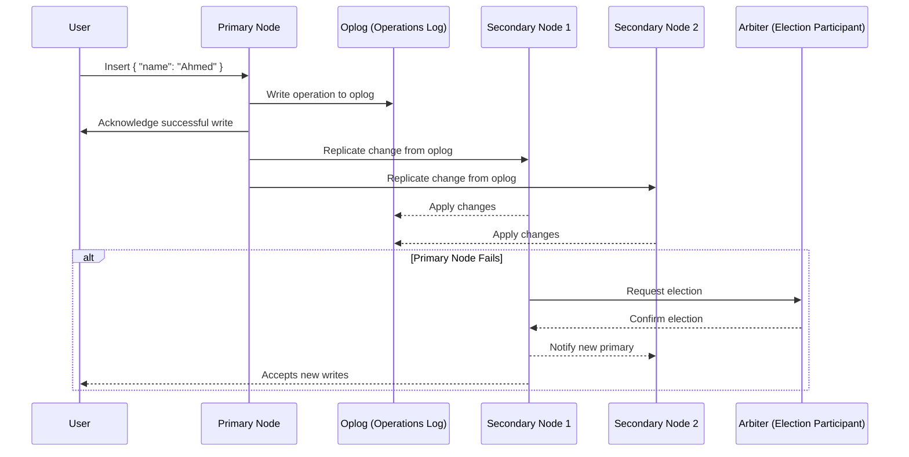
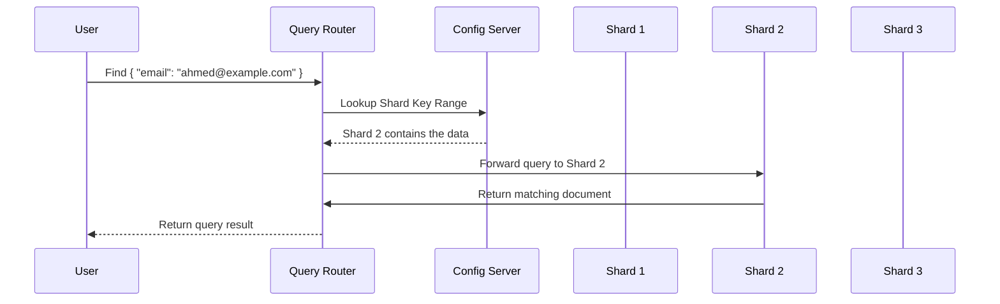

# **🔍 MongoDB Internals – Deep Dive into Replication & Sharding (How MongoDB Scales) 🚀**

MongoDB is **designed for scalability and high availability**, using two core mechanisms:

✔️ **Replication** – Copies data across multiple nodes for **fault tolerance**.  
✔️ **Sharding** – Distributes large datasets across multiple machines for **horizontal scaling**.

---

## **🌍 1️⃣ MongoDB Replication – High Availability & Fault Tolerance**

Replication ensures **data redundancy and failover support** by **copying data across multiple nodes**. MongoDB **automatically handles node failures** and **elects a new primary when needed**.

---

### **💡 Replica Set Architecture**

A **Replica Set** is a group of **MongoDB nodes** that maintain **identical copies of data**.

✔️ **Primary Node** – Accepts **write and read operations (by default)**.  
✔️ **Secondary Nodes** – Replicate data from the primary, can serve **read operations (if configured)**.  
✔️ **Arbiter (Optional)** – Participates in leader election but **doesn’t store data**.

### **📌 Components of a Replica Set**

| **Component**              | **Function**                                          |
| -------------------------- | ----------------------------------------------------- |
| **Primary Node**           | Handles all **writes & reads (by default)**.          |
| **Secondary Nodes**        | Copy data from the primary using the **oplog**.       |
| **Oplog (Operations Log)** | Stores a **history of changes** from the primary.     |
| **Arbiter (Optional)**     | Participates in elections but **doesn't store data**. |
| **Replica Set Elections**  | Automatically **chooses a new primary** when needed.  |

---

### **🔄 How Replication Works Internally – Step-by-Step**

#### **💡 Write Operation in a Replica Set**

- **1️⃣ Client writes to the primary node** (`db.users.insertOne(...)`).
- **2️⃣ Primary stores the write in memory** (WiredTiger cache).
- **3️⃣ Primary writes the change to the oplog** (Operations Log).
- **4️⃣ Secondaries continuously poll the oplog** and apply changes.
- **5️⃣ Secondaries confirm they have replicated the write.**
- **6️⃣ Primary acknowledges the write to the client.**

#### **💡 Read Operation in a Replica Set**

- **✔️ By default, reads go to the primary** for strong consistency.
- **✔️ Optionally, clients can read from secondaries** for better performance.
- **✔️ Secondary nodes lag slightly behind the primary (replication lag).**

---

### **🎯 Sequence Diagram: How MongoDB Replication Works**

💡 **Key Takeaways from Replication:**  
✔️ **Writes happen on the primary, and secondaries replicate changes asynchronously.**  
✔️ **The oplog keeps a history of all changes to synchronize secondary nodes.**  
✔️ **Automatic failover occurs if the primary node goes down.**  
✔️ **Clients can choose to read from secondaries to balance load.**

---

## **📡 2️⃣ How MongoDB Sharding Works (Horizontal Scaling)**

💡 **Sharding allows MongoDB to store massive datasets across multiple servers**.  
✔️ **Used when a single machine cannot handle all the data.**  
✔️ **Each machine (shard) stores a portion of the data.**  
✔️ **A Query Router (`mongos`) directs queries to the correct shard.**

---

### **💡 Sharded Cluster Architecture**

A **Sharded Cluster** consists of:  
✔️ **Shards** – Each shard stores **a subset of the data**.  
✔️ **Query Router (`mongos`)** – Routes client requests to the correct shard.  
✔️ **Config Servers** – Store metadata about shard key ranges.

| **Component**               | **Function**                                                |
| --------------------------- | ----------------------------------------------------------- |
| **Shards**                  | Store data, each shard is a **replica set** for redundancy. |
| **Config Servers**          | Maintain **metadata & shard key ranges**.                   |
| **Query Router (`mongos`)** | Forwards queries to the correct shard(s).                   |
| **Shard Key**               | Determines how data is **split across shards**.             |

---

### **🔄 4️⃣ How Sharding Works Internally – Step-by-Step**

#### **💡 Sharding Write Operation**

- **1️⃣ Client sends a write request to `mongos`**.
- **2️⃣ `mongos` checks the config servers** to determine the correct shard.
- **3️⃣ Write is forwarded to the correct shard.**
- **4️⃣ Shard writes the data, and a confirmation is sent back to the client.**

#### **💡 Sharding Read Operation**

- **1️⃣ Client sends a read request to `mongos`**.
- **2️⃣ If the query contains the shard key, `mongos` sends the request to one shard.**
- **3️⃣ If the query doesn’t contain the shard key, `mongos` queries all shards (scatter-gather).**
- **4️⃣ Results are merged and sent to the client.**

---

### **🎯 Sequence Diagram: How MongoDB Sharding Works**

💡 **Key Takeaways from Sharding:**  
✔️ **Data is distributed across multiple shards using a shard key.**  
✔️ **`mongos` ensures clients don’t need to know where data is stored.**  
✔️ **If a query includes the shard key, only one shard is queried (fast).**  
✔️ **If a query doesn't include the shard key, all shards are queried (slow).**

---

## **🏆 5️⃣ Summary – How MongoDB Scales with Replication & Sharding**

✔️ **Replication ensures high availability by maintaining multiple copies of data.**  
✔️ **Sharding distributes data across multiple servers for horizontal scaling.**  
✔️ **Clients read from Replica Sets, and Query Routers (`mongos`) manage queries in sharded clusters.**  
✔️ **MongoDB can scale both vertically (faster hardware) and horizontally (more servers).**
