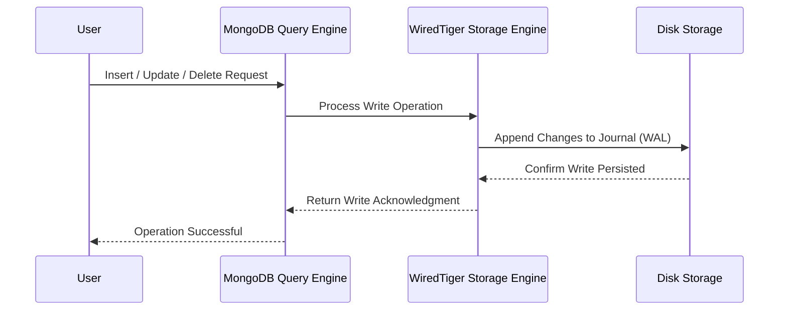

# **🛠️ MongoDB CRUD Operations – Insert, Update, Delete & Best Practices 🚀**

CRUD (Create, Read, Update, Delete) operations are the foundation of working with MongoDB. While **querying** focuses on retrieving data efficiently, **CRUD operations** ensure data is modified and maintained correctly.

---

## **📝 1️⃣ Inserting Documents in MongoDB**

### **📌 `InsertOne()` – Insert a Single Document**

```bash
db.users.insertOne({
  "name": "Ahmed",
  "email": "ahmed@example.com",
  "age": 30,
  "status": "active"
})
```

✔️ **Generates an `_id` field automatically if not provided.**  
✔️ **Returns an acknowledgment with the inserted ID.**

---

### **📌 `InsertMany()` – Insert Multiple Documents**

```bash
db.users.insertMany([
  { "name": "Ali", "email": "ali@example.com", "age": 25 },
  { "name": "Sara", "email": "sara@example.com", "age": 28 }
])
```

✔️ **Inserts multiple documents in one operation.**  
✔️ **Faster than calling `insertOne()` multiple times.**

---

## **🔄 2️⃣ Updating Documents in MongoDB**

MongoDB provides **multiple ways to update documents**:  
✔️ **Update specific fields (`$set`)**  
✔️ **Increment values (`$inc`)**  
✔️ **Modify arrays (`$push`, `$pull`, `$addToSet`)**

---

### **📌 `UpdateOne()` – Update a Single Document**

```bash
db.users.updateOne(
  { "email": "ahmed@example.com" },
  { "$set": { "status": "inactive" } }
)
```

✔️ **Updates the first matching document only.**  
✔️ **Only updates specified fields (doesn’t overwrite the entire document).**

---

### **📌 `UpdateMany()` – Update Multiple Documents**

```bash
db.users.updateMany(
  { "status": "active" },
  { "$set": { "status": "inactive" } }
)
```

✔️ **Updates all matching documents.**  
✔️ **Efficient for bulk updates.**

---

### **📌 `$inc` – Increment Numeric Fields**

💡 **Increase the `age` field by 1 for a user.**

```bash
db.users.updateOne(
  { "email": "ahmed@example.com" },
  { "$inc": { "age": 1 } }
)
```

✔️ **Useful for counters, stock management, etc.**

---

### **📌 `$push`, `$pull`, `$addToSet` – Updating Arrays**

💡 **Add a new tag to a user’s `tags` array.**

```bash
db.users.updateOne(
  { "email": "ahmed@example.com" },
  { "$push": { "tags": "mongodb" } }
)
```

💡 **Remove `"mongodb"` from the `tags` array.**

```bash
db.users.updateOne(
  { "email": "ahmed@example.com" },
  { "$pull": { "tags": "mongodb" } }
)
```

💡 **Ensure `"mongodb"` is added only once.**

```bash
db.users.updateOne(
  { "email": "ahmed@example.com" },
  { "$addToSet": { "tags": "mongodb" } }
)
```

✔️ **Useful for managing array fields efficiently.**

---

## **❌ 3️⃣ Deleting Documents in MongoDB**

### **📌 `DeleteOne()` – Delete a Single Document**

```bash
db.users.deleteOne({ "email": "ahmed@example.com" })
```

✔️ **Deletes the first matching document only.**  
✔️ **Useful for deleting a single user or record.**

---

### **📌 `DeleteMany()` – Delete Multiple Documents**

```bash
db.users.deleteMany({ "status": "inactive" })
```

✔️ **Deletes all matching documents.**  
✔️ **Use with caution to avoid accidental data loss!**

---

## **✅ 4️⃣ Atomic Operations & Best Practices for Safe Updates**

### **📌 Use `findOneAndUpdate()` to Get the Updated Document**

💡 **Return the updated user document after increasing age by 1.**

```bash
db.users.findOneAndUpdate(
  { "email": "ahmed@example.com" },
  { "$inc": { "age": 1 } },
  { returnDocument: "after" }
)
```

✔️ **Returns the updated document directly.**

---

### **📌 Use Transactions for Multi-Step Operations**

💡 **If modifying multiple collections, wrap updates in a transaction.**

```javascript
const session = db.getMongo().startSession();
session.startTransaction();
try {
  db.orders.updateOne({ _id: 123 }, { $set: { status: "shipped" } });
  db.inventory.updateOne({ productId: 456 }, { $inc: { stock: -1 } });
  session.commitTransaction();
} catch (error) {
  session.abortTransaction();
}
session.endSession();
```

✔️ **Ensures consistency across multiple updates.**

---

## **🎯 5️⃣ Sequence Diagram – MongoDB CRUD Workflow**



💡 **Key Takeaways from the Sequence Diagram:**  
✔️ **Writes go through WiredTiger before being committed to disk.**  
✔️ **MongoDB uses journaling for durability.**  
✔️ **All CRUD operations return an acknowledgment.**

---

## **🏆 6️⃣ Summary – MongoDB CRUD Best Practices**

✔️ **Use `insertOne()` & `insertMany()` for inserting documents efficiently.**  
✔️ **Use `updateOne()`, `updateMany()`, and atomic operators (`$set`, `$inc`, `$push`) for updates.**  
✔️ **Use `deleteOne()` and `deleteMany()` cautiously to avoid accidental deletions.**  
✔️ **Use transactions for multi-step operations that need consistency.**  
✔️ **Use `findOneAndUpdate()` to get updated documents immediately.**

---

Now that we’ve covered **CRUD operations**, we can move to **MongoDB Aggregation & Advanced Data Processing**.

🛠 **Next Topics:**  
✔️ **MongoDB Aggregation Framework – Grouping, Filtering & Data Transformation**  
✔️ **Working with Geospatial Data & Text Search in MongoDB**

💡 **Let me know if you want to continue! 🚀🔥**
