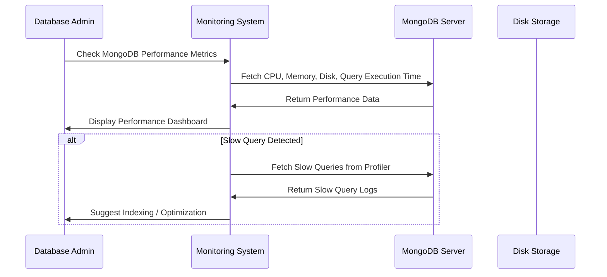

# **📊 MongoDB Monitoring & Profiling – Detecting Performance Issues & Bottlenecks 🚀**

MongoDB **performance issues** often arise from **poor query patterns, excessive disk I/O, memory pressure, or inefficient indexing**. **Monitoring** and **profiling** help detect these issues before they cause serious problems.

---

## **📡 1️⃣ MongoDB Monitoring – How to Detect Performance Issues**

💡 **MongoDB provides built-in tools and external monitoring solutions to track database performance.**

### **🔍 Built-in MongoDB Monitoring Tools**

| **Tool**                                | **Purpose**                                                     |
| --------------------------------------- | --------------------------------------------------------------- |
| **`db.stats()`**                        | Provides an overview of database size, storage, and indexes.    |
| **`db.serverStatus()`**                 | Returns detailed server health metrics (CPU, memory, disk I/O). |
| **`mongostat`**                         | Real-time database statistics (queries/sec, inserts/sec).       |
| **`mongotop`**                          | Shows how much time MongoDB spends reading/writing collections. |
| **MongoDB Ops Manager / Cloud Manager** | Full-featured monitoring for MongoDB clusters.                  |
| **Prometheus + Grafana**                | Custom monitoring dashboards for MongoDB.                       |

---

### **💡 How to Check MongoDB Server Health**

✔️ **Check MongoDB System Status**

```bash
db.serverStatus()
```

✔️ **Monitor Active Connections**

```bash
db.serverStatus().connections
```

✔️ **Check Memory Usage & Cache Efficiency**

```bash
db.serverStatus().wiredTiger.cache
```

---

### **🔍 `mongostat` – Real-Time MongoDB Monitoring**

💡 **`mongostat` provides a live view of MongoDB performance.**

```bash
mongostat --host localhost --port 27017
```

✔️ **Shows real-time read/write operations.**  
✔️ **Monitors query execution, insert/update/delete rates.**  
✔️ **Detects replication lag in replica sets.**

Example Output:

```ini
insert query update delete getmore command dirty used flushes vsize   res
     12    32      5      3      10      8     0.5   60%    5     1GB  512MB
```

✔️ **High insert/query rates = Good performance.**  
✔️ **Low dirty % and low flushes = Efficient memory usage.**  
✔️ **High command execution time = Possible performance issue.**

---

### **🔍 `mongotop` – Collection Read/Write Time Monitoring**

💡 **`mongotop` shows how much time MongoDB spends reading & writing collections.**

```bash
mongotop
```

✔️ **Helps identify slow collections.**  
✔️ **Shows which collections are consuming the most I/O.**  
✔️ **Useful for detecting high disk usage issues.**

Example Output:

```ini
                        ns         total      read    write
database.users          30ms       25ms      5ms
database.orders         50ms       40ms      10ms
```

✔️ **High read time = Indexes missing or too many queries.**  
✔️ **High write time = Frequent updates/inserts, possible write locks.**

---

## **🔍 2️⃣ MongoDB Profiling – Identifying Slow Queries & Bottlenecks**

💡 **MongoDB provides the Query Profiler to detect slow queries and optimize them.**

### **📌 Enabling Query Profiling**

✔️ **Enable profiling for slow queries (queries that take longer than 100ms).**

```bash
db.setProfilingLevel(1, 100)  # Logs queries slower than 100ms
```

✔️ **Enable profiling for all queries (for deep analysis).**

```bash
db.setProfilingLevel(2)  # Logs all queries (use with caution)
```

✔️ **Check profiling status.**

```bash
db.getProfilingStatus()
```

---

### **🔍 Viewing Slow Queries in the Profiler**

✔️ **Find the slowest queries in the profiler.**

```bash
db.system.profile.find().sort({ millis: -1 }).limit(5)
```

✔️ **Example Output (Shows Queries Taking Over 200ms)**

```json
{
  "op": "query",
  "ns": "users",
  "query": { "email": "ahmed@example.com" },
  "keysExamined": 500000,
  "docsExamined": 500000,
  "executionTimeMillis": 225
}
```

💡 **Problem: The query is scanning 500,000 documents (full collection scan).**  
✔️ **Solution: Create an index on `email`.**

```bash
db.users.createIndex({ "email": 1 })
```

---

## **📊 3️⃣ Key Metrics to Monitor in MongoDB**

💡 **MongoDB performance depends on CPU, Memory, Disk, and Network usage.**

| **Metric**             | **What It Means**                               | **How to Monitor**                 |
| ---------------------- | ----------------------------------------------- | ---------------------------------- |
| **CPU Usage**          | High CPU = Expensive queries                    | `top`, `htop`, `db.serverStatus()` |
| **Memory Usage**       | Should be < 75% of available RAM                | `db.serverStatus().mem`            |
| **Disk I/O**           | High disk usage = Slow queries, missing indexes | `mongotop`, `iostat`               |
| **Active Connections** | Too many connections = Bottlenecks              | `db.serverStatus().connections`    |
| **Replication Lag**    | High lag = Slow replication                     | `rs.status()`                      |
| **Locking**            | High lock time = Blocking writes                | `db.currentOp()`                   |

✔️ **Monitor these metrics to prevent performance issues before they become critical.**

---

## **🎯 4️⃣ Sequence Diagram – How MongoDB Monitoring Works**



💡 **Key Takeaways from Monitoring:**  
✔️ **Automated monitoring tools detect slow queries & performance issues.**  
✔️ **Alerts can be set up for high CPU, memory, or replication lag.**  
✔️ **Profiling helps detect slow queries that need optimization.**

---

## **🏆 5️⃣ Summary – MongoDB Performance Monitoring & Profiling Best Practices**

✔️ **Use `mongostat`, `mongotop`, and `db.serverStatus()` to monitor real-time performance.**  
✔️ **Enable profiling to detect slow queries.**  
✔️ **Optimize slow queries using indexes and aggregation improvements.**  
✔️ **Monitor CPU, Memory, Disk I/O, and Network for system health.**  
✔️ **Use Prometheus, Grafana, or MongoDB Ops Manager for advanced monitoring.**  
✔️ **Set alerts for slow queries, high CPU usage, and replication lag.**
