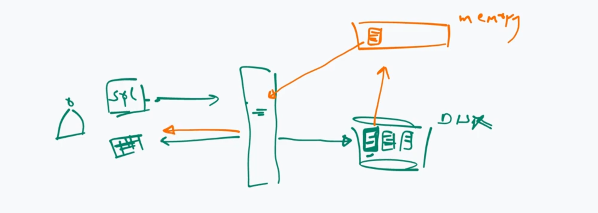
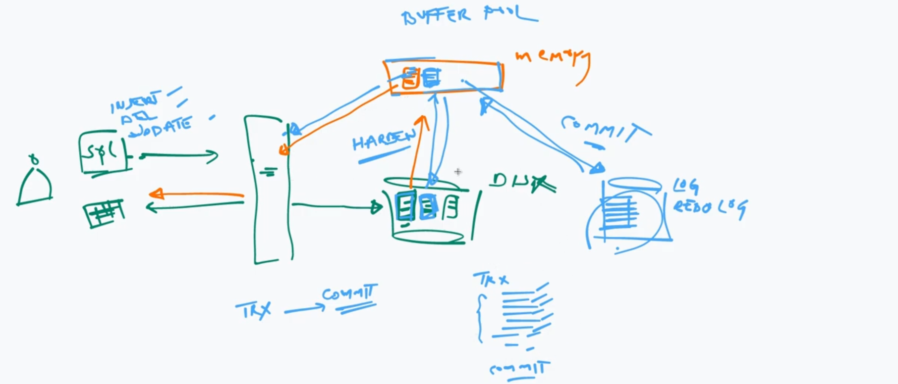
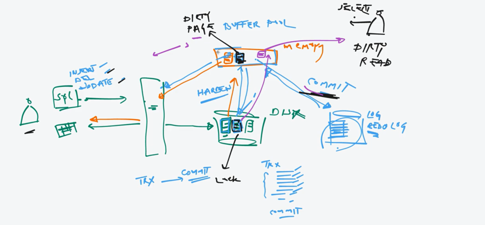

# Query Execution Plan

## How SELECT Query Executed

## How Transactions Executed (ACID)

### How Atomicity, Consistency and Durability Works

### How Isolation Works

Behaviors:

1. Lock Read Dirty Pages
2. Allow Read Dirty Pages
3. Read Old Pages

Names:

1. Dirty Read Level
2. Non-repeatable Read Level
3. Phantom Read Level
