# 🤔 Non-Clustered Index Questions

## **How Non-Clustered Index Works?**

A **non-clustered index** is a separate data structure that speeds up queries by storing **indexed column values** along with **row locators (pointers)** to the actual data rows in the main table. Unlike a **clustered index**, which determines the physical order of rows, a non-clustered index only maintains references to rows, making **lookups efficient but requiring extra reads** for non-indexed columns.

### **🔖 How Data Pages Are Retrieved in Non-Clustered Index Queries**

When executing a query that uses a **non-clustered index**, the database engine follows these steps:

#### **1️⃣ Query Parsing and Optimization**

- The SQL engine **parses** the query.
- The **query optimizer** selects the best **execution plan**, deciding whether to use an **index scan or seek**.

#### **2️⃣ Non-Clustered Index Traversal**

- If the optimizer chooses a **non-clustered index**, the engine **scans the index B-tree** to locate **row IDs (RID) or primary keys**.
- The index **does not contain full table rows**—only the indexed column(s) and row locators.

✔ **Example: Index on `name` Column**

```sql
SELECT age FROM Employees WHERE name IN ('Alice', 'Bob', 'Charlie');
```

| **Index (Sorted by `name`)** | **Row ID (RID)** | **Page Reference** |
| ---------------------------- | ---------------- | ------------------ |
| Alice                        | 1                | 📄 **Page A**      |
| Bob                          | 2                | 📄 **Page A**      |
| Charlie                      | 3                | 📄 **Page B**      |

📌 The **index does not contain `age`**, so we must **retrieve the actual rows**.

#### **3️⃣ Buffer Cache Check**

- Before fetching data from disk, the database **checks the buffer cache** to see if the required pages are already in memory.
- If a page **is in memory**, it is read directly.
- If **not**, the database **loads it from disk into the cache**.

```mermaid
sequenceDiagram
    participant Query as Query Execution 🔍
    participant Index as Non-Clustered Index 📖
    participant Buffer as Buffer Cache (RAM) 🖥️
    participant Disk as Disk Storage 💽
    participant PageA as Data Page A 📄
    participant PageB as Data Page B 📄

    Query->>Index: Find Employees where name IN ('Alice', 'Bob', 'Charlie')
    Index->>Query: Return Row IDs (1, 2, 3)

    Query->>Buffer: Is Page A in Memory?
    alt Page A Found
        Buffer->>Query: Read from RAM 🖥️
    else Page A Not Found
        Query->>Disk: Load Page A 💽
        Disk->>Buffer: Store Page A in Cache 🖥️
        Buffer->>Query: Read from RAM 🖥️
    end

    Query->>Buffer: Is Page B in Memory?
    alt Page B Found
        Buffer->>Query: Read from RAM 🖥️
    else Page B Not Found
        Query->>Disk: Load Page B 💽
        Disk->>Buffer: Store Page B in Cache 🖥️
        Buffer->>Query: Read from RAM 🖥️
    end
```



✔ **If a page is found in RAM**, it **avoids disk I/O**, improving performance.  
✔ **If a page is not found**, it is **read from disk**, which is slower.

#### **4️⃣ Fetching Data from Pages**

- After loading the required pages into memory, the database:
  - Retrieves `Alice` & `Bob` from **Page A**.
  - Retrieves `Charlie` from **Page B**.

| **Row ID** | **Name** | **Age** | **Data Page** |
| ---------- | -------- | ------- | ------------- |
| 1          | Alice    | 30      | 📄 **Page A** |
| 2          | Bob      | 25      | 📄 **Page A** |
| 3          | Charlie  | 35      | 📄 **Page B** |

### **📖 Summary: How a Non-Clustered Index Works**

| **Step**                  | **Action**                           | **Performance Impact**                |
| ------------------------- | ------------------------------------ | ------------------------------------- |
| **1️⃣ Index Scan/Seek**    | Finds row IDs for indexed values     | Fast (Logarithmic Time)               |
| **2️⃣ Buffer Cache Check** | Checks if pages are in RAM           | If present, avoids disk I/O           |
| **3️⃣ Data Page Loading**  | Loads pages into cache if missing    | Can cause redundant reads if evicted  |
| **4️⃣ Data Fetch**         | Retrieves missing columns from pages | Extra lookups if index isn’t covering |
| **5️⃣ Query Execution**    | Returns final results                | Optimized with caching & indexing     |

🔹 **Non-clustered indexes improve query speed but require extra reads when missing columns**.

---

## **Why Does a Non-Clustered Index Re-Read the Same Data Page Multiple Times?**

### **🔖 How Non-Clustered Index Scans Work**

A **non-clustered index** stores **only indexed columns** along with **row locators (pointers)** to the actual data rows. When a query needs **columns not covered by the index**, the database engine must:

1. **Scan/seek the index** to find relevant **row IDs**.
2. **Fetch missing columns** from the actual table **(key lookup or RID lookup)**.
3. **Perform random I/O operations**, leading to **multiple reads of the same page** in some cases.

### **🔖 Why May a Non-Clustered Index Load the Same Data Page More Than Once?**

#### **1️⃣ Row Locators Are Not Sorted by Data Page Order**

- A **non-clustered index returns row pointers** sorted by the indexed column (e.g., `Age`), but the actual **rows in the table are scattered across different pages**.
- This means the database **may access the same page multiple times** if different row pointers **refer to the same page at different points in the scan**.

✔ **Example (Index on `Age`, but fetching `Salary` too)**:

```sql
SELECT Name, Salary FROM Employees WHERE Age > 30;
```

| **Index Scan Order (by Age)** | **Row ID (RID)** | **Data Page**  |
| ----------------------------- | ---------------- | -------------- |
| Age 31 → RID 105              | 105              | 📄 **Page 10** |
| Age 32 → RID 78               | 78               | 📄 **Page 5**  |
| Age 32 → RID 80               | 80               | 📄 **Page 5**  |
| Age 33 → RID 200              | 200              | 📄 **Page 20** |
| Age 34 → RID 105              | 105              | 📄 **Page 10** |

🔹 **Problem**: **Page 10 is accessed twice**, causing redundant I/O.

#### **2️⃣ Non-Clustered Index on a Heap Table Causes Inefficient Lookups**

- If the table has **no clustered index (heap table)**, row pointers **point to physical file locations**.
- **Updates may move rows** to new pages, but **the index still references old locations**.
- The database may **fetch the wrong page, realize the row moved, and re-read the correct page**, increasing I/O.

✔ **Fix:** Use a **clustered index** to **ensure efficient row ordering**.

#### **3️⃣ Pages Can Be Evicted from Cache, Forcing Re-Reads**

- If **multiple queries run** or memory is limited, some pages may be **removed from cache**.
- When needed again, the database **must reload them from disk**, causing additional I/O.
- **Clustered indexes** minimize this by ensuring **sequential row storage**.

### **🔖 Why Doesn’t the Database Remove Duplicate Page Reads Before Executing I/O?**

#### **1️⃣ Sorting Row IDs Before Fetching Data is Expensive**

- If the database **pre-sorts row IDs** by page before reading, it incurs **extra CPU and memory overhead**.
- Sorting takes time, delaying **execution** instead of immediately retrieving results.
- Instead, the database **prioritizes fast, low-latency execution** and processes requests **as they arrive**.

#### **2️⃣ Parallel Execution Reads Pages Simultaneously**

- Modern **databases use multiple threads** to fetch data **in parallel**.
- Instead of **removing duplicates**, databases prefer **concurrent I/O operations**.
- If **different threads access the same page**, the **database handles page-level synchronization internally**, but duplicate reads may still occur.

✔ **Example: Parallel Reads on Data Pages**:


🔹 **Result:** **Page 10 is accessed twice** due to parallel execution.

#### **3️⃣ Concurrency & Data Consistency**

- In **multi-user environments**, another transaction may **update the row** while the query is running.
- If the database **pre-sorts row IDs**, the final data might be **outdated** by the time it reaches execution.
- Instead, databases fetch rows **as soon as they are located** for **better concurrency control**.

### **🔖 When Do Databases Optimize Page Reads?**

Some query execution plans optimize repeated page reads using:

1. **Key Lookups in Clustered Indexes** – Avoids unnecessary scans.
2. **Index Intersection or Merge Joins** – Optimizes multiple index scans.
3. **Batch Processing** – Some **query optimizers group row IDs by page before fetching**.
4. **Manually tuning execution plans** (e.g., `MAXDOP 1` to control parallelism).

✔ **Example:**

```sql
SELECT Name, Salary FROM Employees WHERE Age > 30 OPTION (MAXDOP 1);
```

🔹 **`MAXDOP 1` forces a single-threaded execution**, potentially reducing redundant reads.

### **🔖 How to Reduce Redundant Reads in Non-Clustered Indexes?**

✅ **Solution 1: Use a Covered Index**

- Add required columns to the index using `INCLUDE`:

```sql
CREATE INDEX IX_Age ON Employees (Age) INCLUDE (Salary);
```

🔹 **Avoids key lookups by storing extra columns in the index**.

✅ **Solution 2: Use a Clustered Index**

- If the table is a **heap**, creating a **clustered index** reduces unnecessary I/O:

```sql
CREATE CLUSTERED INDEX IX_EmployeeID ON Employees (EmployeeID);
```

🔹 **Ensures rows are stored in sequential order**, improving access patterns.

✅ **Solution 3: Rebuild Fragmented Indexes**

- If the **non-clustered index is fragmented**, reads become inefficient.
- **Rebuild the index** to improve performance:

```sql
ALTER INDEX IX_Age ON Employees REBUILD;
```

🔹 **Reduces fragmentation and optimizes row access**.

### **📖 Summary: Why Non-Clustered Indexes May Read the Same Page Multiple Times?**

| **Issue**                                          | **Why It Happens?**                                                          | **How to Fix?**                        |
| -------------------------------------------------- | ---------------------------------------------------------------------------- | -------------------------------------- |
| **Row locators are not sorted by data page order** | Index orders data by key (e.g., `Age`), but rows in the table are scattered. | Use **Covered Index** (INCLUDE)        |
| **Heap tables require extra lookups**              | No clustered index, so row lookups are inefficient.                          | Use a **Clustered Index**              |
| **Parallel execution & concurrency**               | Multi-threaded reads access the same page in different orders.               | **Limit parallelism** using `MAXDOP`   |
| **Pages may be evicted from cache**                | Pages not always available in memory, causing disk reads.                    | Optimize **index structure & caching** |

### **🤔 Final Thoughts**

- **Non-clustered indexes** may **re-read the same page multiple times** due to **unordered row locators, parallel execution, and concurrency handling**.
- A **clustered index ensures sequential row storage**, reducing unnecessary reads.
- Using **Covered Indexes, Clustered Indexes, and Index Maintenance** helps **minimize redundant page reads**.
