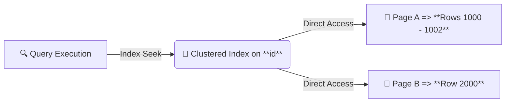
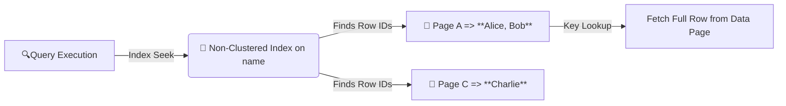

# ⚖️ **Clustered Index vs. Non-Clustered Index (in Lifecycle)**

A **clustered index** and a **non-clustered index** handle **data storage, retrieval, and page access** differently. The **lifecycle of query execution, indexing, and data retrieval** is crucial to understanding their performance impact.

---

## **🔖 Why a Clustered Index is Better for Data Page Retrieval**

### **1️⃣ Data Organization: Clustered Index Stores Data in Order**

- A **clustered index** keeps **data rows physically sorted** based on the **index key**.
- This means **related rows are stored together**, optimizing **range queries and sequential scans**.

✔ **Example: Clustered Index on `id`**

```sql
CREATE CLUSTERED INDEX idx_id ON Employees(id);
```

| **id (Clustered Index Key)** | **Name** | **Age** | **Data Page** |
| ---------------------------- | -------- | ------- | ------------- |
| 1000                         | Alice    | 30      | 📄 **Page A** |
| 1001                         | Bob      | 25      | 📄 **Page A** |
| 1002                         | Charlie  | 35      | 📄 **Page A** |
| 2000                         | David    | 40      | 📄 **Page B** |

🔹 **If a query searches for `id BETWEEN 1000 AND 2000`**, the engine **reads contiguous pages** instead of jumping between scattered ones.

---

### **2️⃣ Efficient Data Retrieval: Clustered Index Requires Fewer Reads**

- Since data is **physically ordered**, retrieving a range of rows is **efficient**.
- **The database can fetch pages in one sequential I/O operation instead of multiple scattered reads.**

✔ **Query Example**

```sql
SELECT * FROM Employees WHERE id BETWEEN 1000 AND 2000;
```

- **Clustered Index Access:** Reads contiguous pages (**Page A → Page B**)
- **Non-Clustered Index Access:** Needs **extra lookups** to find the scattered rows



🔹 **Clustered index ensures sequential access → Fewer page reads → Faster query execution.**

---

### **3️⃣ Single Lookup (No Extra Key Lookups)**

- A **clustered index** stores **actual data in the index leaf nodes**.
- When a query **finds a matching index key**, it **directly retrieves the row**.

✔ **Example**

```sql
SELECT * FROM Employees WHERE id = 1000;
```

- **Clustered Index Seek**: Directly goes to **Page A** (single operation).
- **Non-Clustered Index Seek**:
  1. Finds row ID in **index pages**
  2. Retrieves the actual row from **table pages (extra lookup)**

🔹 **Clustered indexes eliminate extra key lookups, reducing I/O operations.**

---

### **4️⃣ Reduced Fragmentation**

- Since **clustered indexes** ensure **data is physically sorted**, fragmentation is reduced.
- **Less fragmentation = Fewer page splits = Better performance**.
- **Non-clustered indexes** store **row pointers**, which may point to scattered data, increasing fragmentation.

---

## **🔖 Non-Clustered Index Considerations**

### **1️⃣ Separate Storage (Index Keys vs. Data Rows)**

- In a **non-clustered index**, the **index keys** and **actual data rows** are stored separately.
- The **index contains pointers (row locators)** to the **actual rows**.

✔ **Example: Non-Clustered Index on `name`**

```sql
CREATE INDEX idx_name ON Employees(name);
```

| **Index (Sorted by `name`)** | **Row ID (RID)** | **Page Reference** |
| ---------------------------- | ---------------- | ------------------ |
| Alice                        | 1000             | 📄 **Page A**      |
| Bob                          | 1001             | 📄 **Page A**      |
| Charlie                      | 1002             | 📄 **Page C**      |
| David                        | 2000             | 📄 **Page D**      |

- The index **stores sorted names**, but **actual data is in different pages**.
- Querying `name IN ('Alice', 'Bob', 'Charlie')` **requires multiple page fetches**.

---

### **2️⃣ Additional Lookups**

- Since the **index doesn’t store the full row**, the database needs an **extra step**:
  1. **Index Seek** → Find row IDs.
  2. **Key Lookup** → Fetch missing columns from the **data pages**.



🔹 **More lookups = More I/O operations = Slower performance compared to a clustered index.**

---

### **3️⃣ Data Fragmentation in Non-Clustered Indexes**

- Since **data rows are not stored in index order**, they might be **fragmented across multiple pages**.
- **Range queries suffer because** the database **must fetch scattered pages**.

✔ **Example: Query Using a Non-Clustered Index**

```sql
SELECT * FROM Employees WHERE name IN ('Alice', 'Bob', 'Charlie');
```

| **Name** | **Row ID** | **Page Reference** |
| -------- | ---------- | ------------------ |
| Alice    | 1000       | 📄 **Page A**      |
| Bob      | 1001       | 📄 **Page A**      |
| Charlie  | 1002       | 📄 **Page C**      |

- **Alice & Bob are in Page A**, but **Charlie is in Page C**.
- This forces **extra I/O operations** compared to **sequential reads in a clustered index**.

---

## **🔖 Example Query Performance Comparison**

### **Clustered Index vs. Non-Clustered Index Execution Times**

| **Query**                            | **Clustered Index Seek (ms)** | **Non-Clustered Index Seek (ms)** | **Non-Clustered Index Scan (ms)** |
| ------------------------------------ | ----------------------------- | --------------------------------- | --------------------------------- |
| **`WHERE id = 1000`**                | **5ms**                       | **10ms**                          | **50ms**                          |
| **`WHERE name = 'Alice'`**           | **N/A**                       | **15ms**                          | **60ms**                          |
| **`WHERE id BETWEEN 1000 AND 2000`** | **10ms**                      | **30ms**                          | **120ms**                         |

🔹 **Clustered Index Seek is consistently faster due to contiguous storage**.  
🔹 **Non-Clustered Index requires extra lookups, increasing latency**.  
🔹 **Non-Clustered Index Scan is worst (scans entire index instead of seeking).**

---

## **📖 Summary: Clustered vs. Non-Clustered Index**

| **Feature**                 | **Clustered Index**                    | **Non-Clustered Index**                   |
| --------------------------- | -------------------------------------- | ----------------------------------------- |
| **Data Storage**            | **Rows are stored in index order**     | **Rows are stored separately from index** |
| **Query Speed**             | **Faster (direct row access)**         | **Slower (requires key lookups)**         |
| **Range Query Performance** | **Very efficient (sequential access)** | **Slower (random I/O)**                   |
| **Key Lookup Required?**    | ❌ **No**                              | ✅ **Yes**                                |
| **Fragmentation Risk**      | **Lower (data is ordered)**            | **Higher (data is scattered)**            |

✔ **Use Clustered Index** for **primary key lookups, range queries, and sequential access**.  
✔ **Use Non-Clustered Index** for **searching different columns (e.g., name, email) but expect extra lookups**.

---

## **🤔 Final Thoughts**

- **Clustered indexes** improve performance by ensuring **data is physically ordered**.
- **Non-clustered indexes** help with **alternative queries** but require **extra lookups**.
- **Choosing the right index** depends on **query patterns and table structure**.

🚀 **Would you like execution plan details for range queries using both index types?**
